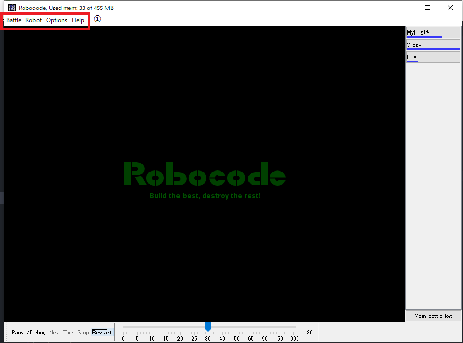
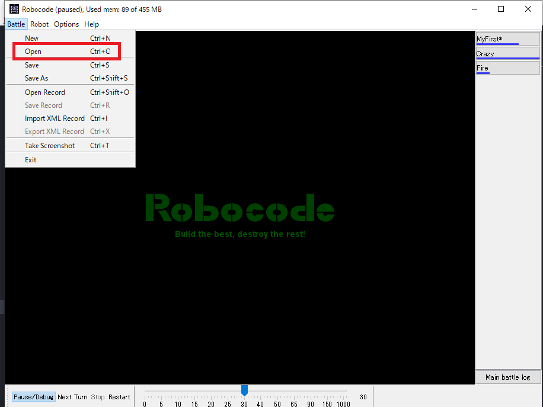
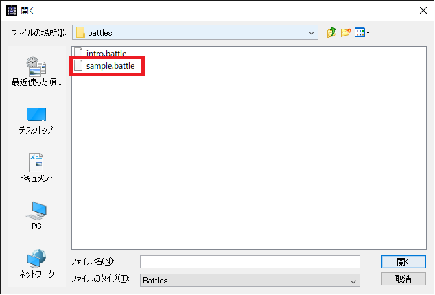
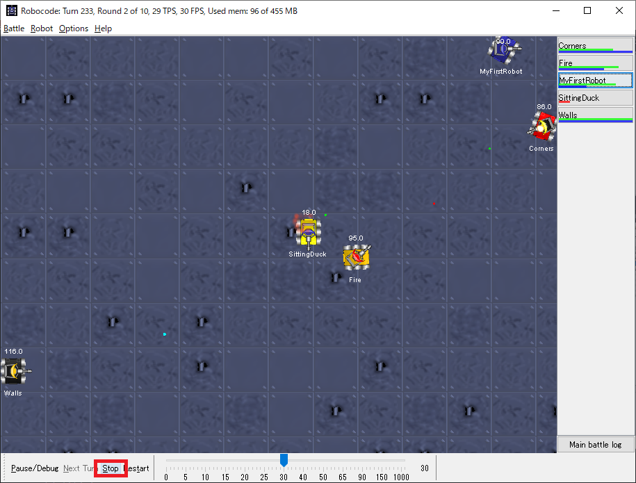
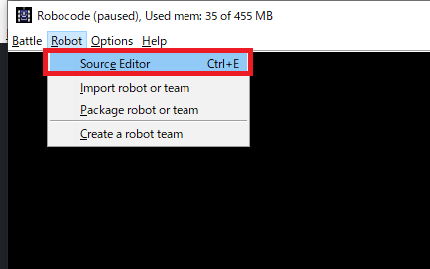
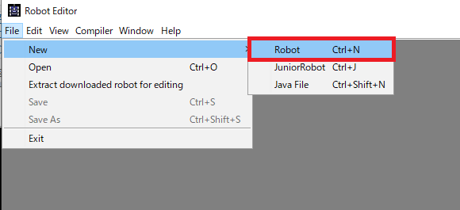
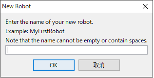
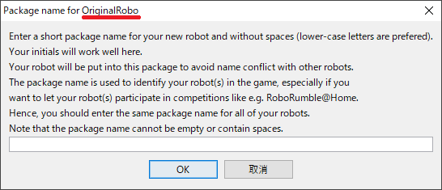
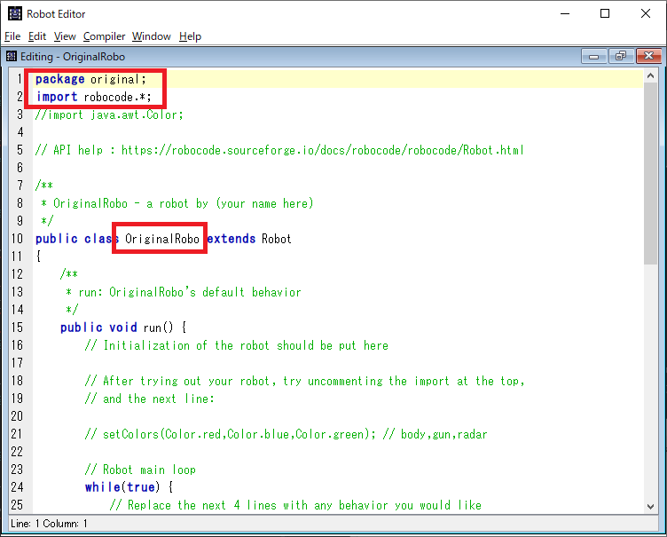

<br/>
<br/>
<br/>
<br/>
<br/>
<br/>
<div style="width: 100%; height: 100%; text-align: center;vertical-align: middle;">
  <font size="6" style="font: "Arial", "メイリオ";">情報システム学科</font>
  <br/><font size="5" style="font-family: "Arial", "メイリオ";">オープンキャンパス</font>
  <div style="width: 100%; text-align: center;vertical-align: middle;">
  <br/>
  <font size="3" style="font-family: "Arial", "メイリオ";">Java プログラミング体験</font><br/>
  <font size="2" style="font-family: "Arial", "メイリオ";">～Robocodedで遊びましょう～</font>
</div>
<br/>
<br/>
<br/>
<br/>
<br/>
<br/>
<br/>
<br/>
<br/>
<br/>
<br/>
<br/>
<br/>
<br/>
<br/>
<br/>

<font style="clear;"/>

## 本日の体験メニューについて
プログラミング言語の**Java**を使ってゲームをします。
そして、皆でバトルします。

# Robocode
これから、プレーするゲームの名前です。インターネットで検索するときは「robocode インストール」と検索するとインストーラー(jarファイル)
をダウンロードできます。

### 準備済みの設定
1. 文字の大きさを変更してあります。

## 初期画面について
起動すると下のような画面が見れます。



赤線で囲っている部分に着目してください。

<br/>
<br/>
<br/>

#### ①メニュー

* Battle:
 1. 新規バトル(New)
 2. バトルを開く(Open)
* Robot:
 1. ソースエディタ(Source editor)
 2. 他のロボ、チーム取り込み(import robot or team)
 3. JARファイルの作成(Package robot or team)
* Options:
 1. 環境設定(Preference),
 2. Roboのキャッシュをクリア(Clean robo cache)
* Help:  ヘルプ

## 動かしてみよう
まずは、サンプルバトルを動かします。下の手順で動かしてください。

Step1 メニューから「Battle」をクリック
 

Step2 sample.battleファイルをクリック
 

<br/>

Step3 Start Battleをクリック


<br/>

Step4 Stopでバトルを修了する
　

動いているのをみて、どんな動きをしているか観察してください。


<br/>
<br/>
<br/>
<br/>
<br/>
<br/>
<br/>
<br/>
<br/>
<br/>
<br/>
<br/>
<br/>


## オリジナル・ロボを作ろう
オリジナルのロボを作ります。下の手順でロボの作成準備をしてください。
Step1 メニューから「Robo」をクリックし、「Source Editor」をクリック
 

Step2 ソースエディタを開き、New -> Roboをクリック
 

Step3 ロボの名前を入力する
 

 <br/>

Step4 ロボのファイルを配置するパッケージの名前を入力する ※ロボの名前には「OrignalRobo」という名前をつけたので、赤線部にロボの名前が表示されています。
 

Step5 テンプレートのロボが作成されるので、オリジナルのロボに改造しましょう。
 

 <br/>
 <br/>
 <br/>
 <br/>
 <br/>

## プログラミングについて
Roboodeは、Javaというプログラミング言語で作られています。
オープンソース・ソフトウェア(OSS)という部類に入ります。
基本的に、ダウンロード、改造ともに自由にやってよいものです。ですが「オープンソースライセンス」というものもあり
ある程度の規制もあります。製作者に迷惑が掛からないようにするためです。

有名なのは、下のものがあります。
* Apache License
* MIT license
* GNU (General Public License)

### プログラムは上から下に流れる
プログラム言語の処理は、上から下に流れます。どのプログラムでも同じことです。

例えば、下のようなコードがあったとします。

```
ahead(100);
ahead(50);
back(20);
back(80);
```

ロボの動きとしては、次のようになります。
1. 前に100進む
1. 前に50進む
2. 20後退する

## ロボの仕組みを知ろう
ロボは次の状態の時の**動きを定義**することでどのように動くか決まります。
* 通常時
* 敵をスキャンした時
* 自分が弾に当たった時
* 壁にぶつかった時

それぞれの**動きを定義**しているのが、次のメソッドというものです。
* 通常時: run()
* 敵をスキャンした時: onScannedRobot()
* 自分が弾に当たった時: onHitByBullet()
* 壁にぶつかった時: onHitWall()

#### 通常時の動き
ロボを作成したばかりの状態ではロボは**通常時**に下のように動きます。
1. 前に100進む
2. 主砲を右へ360度回転
3. 100後退する
2. 主砲を右へ360度回転

#### 敵をスキャンした時
ロボを作成したばかりの状態ではロボは**敵をスキャンした時**に下のように動きます。
1. 弾を発射する: fire(1);

#### 自分が弾に当たった時
ロボを作成したばかりの状態ではロボは**自分が弾に当たった時**に下のように動きます。
1. 10後退する: back(10);

#### 壁にぶつかった時
ロボを作成したばかりの状態ではロボは**壁にぶつかった時**に下のように動きます。
1. 20後退する: back(20);


### やってみよう ①
通常時の動きを、下のように変更してみよう。
1. 前に100進む
2. 主砲を右へ360度回転 -> 50前に進む
3. 100後退する
2. 主砲を右へ360度回転 -> 50後退する

### やってみよう ②
通常時の動きを、下のように変更してみよう。
1. 前に100進む -> 主砲を右へ180度回転
2. 前に50進む
3. 100後退する -> 主砲を左へ180度回転
2. 50後退する

## やってみたことを理解する
「やってみよう①と②」で、通常時の動きを変更しました。

＜デフォルトの動き: Javaのコード＞
1. 前に100進む: ahead(100);
2. 主砲を右へ360度回転: turnGunRight(360);
3. 100後退する: back(100);
4. 主砲を右へ360度回転: turnGunRight(360);

ここで、「runメソッド」の内容を見てみます。コメントの部分は削除します。
* コメントは「//」を描いた後(右側)に書いた文字のことで、プログラムコードとして扱われません。
* そして、Robocodeは日本語入力に対応していません。日本語を入力すると落ちます。

```
/**
 * run: OriginalRobo's default behavior
 */
public void run() {
  // Robot main loop
  while(true) {
    // Replace the next 4 lines with any behavior you would like
    ahead(100);
    turnGunRight(360);
    back(100);
    turnGunRight(360);
  }
}
```

下の命令はロボに命令できる「Roboの命令セット」にある命令です。※のちにロボの命令セット(一部抜粋)を表で示します。
* ahead(100);
* turnGunRight(360);
* back(100);
* turnGunRight(360);

これらの命令は、()の中にある数字を変更することでそれぞれの動きの幅を変更することができます。

例：ahead()の場合
「ahead」の横、「()」にある数字を**引数**と呼びます。上に示した命令の引数を変更することで各命令の「動きの幅」を変更することができます。

ahead(100)と書いてある部分をahead(50)に修正すると100進んでいたのが、50しか進まなくなります。

同じく、turnGunRightの引数を180に変更しようとすると、turnGunRight(180)のようにコードを修正します。


この部分はいったい何でしょうか？
> while(true) { ... }

ズバリ、**無限ループ**です。ゲームや、サーバーなどのアプリケーションは、無限ループを使います。なので「常駐アプリ」などと呼ばれることもあります。

## ロボへ命令する
サンプルバトルを見たときに、ロボはどのような動きをしていたでしょうか？
少なくとも「ジャンプ」はしていませんでした。ロボに出せる「命令」は決まっているのです。そして、下の表のように「命令」が決まっています。

つまり **「命令」を組み合わせてオリジナルのロボを作成します。**

|返り値|メソッド名|振る舞い(処理の内容)|
| ---- | ------- | ---------------- |
|void|ahead(double distance)|ロボットを前方に移動させます。|
|void|back(double distance)|ロボットを後方に移動させます。|
|void|doNothing()|このロボットの今回の順番では、何も動作を行いません。|
|void|fire(double power)|弾丸を発射します。|
|void|scan()|他のロボットを探します。|
|void|setColors(Color robotColor, Color gunColor, Color radarColor)|このメソッドは、ロボットの色を設定するために呼び出します。|
|void|stop()|動作をすべて停止し、 後で resume() 呼び出しを使って再開できるよう、保存します。|
|void|stop(boolean overwrite)|動作をすべて停止し、 後で resume() 呼び出しを使って再開できるよう、保存します。|
|void|turnGunLeft(double degrees)|ロボットの大砲を回転させます。|
|void|turnGunRight(double degrees)|ロボットの大砲を回転させます。|
|void|turnLeft(double degrees)|ロボットを回転させます。|
|void|turnRight(double degrees)|ロボットを回転させます。|
