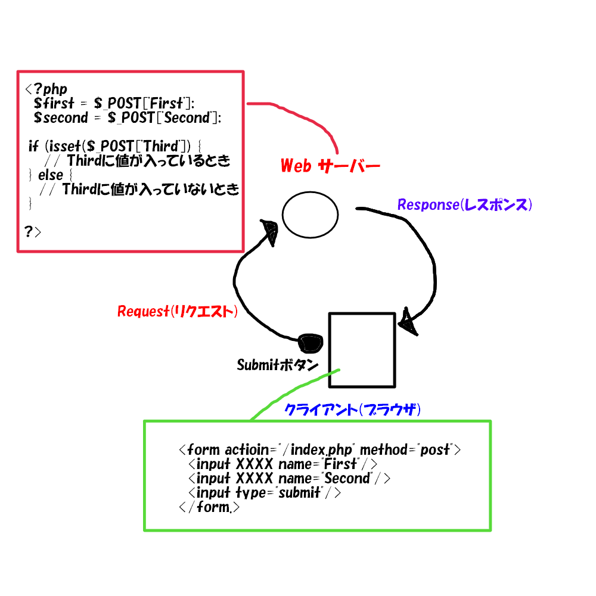
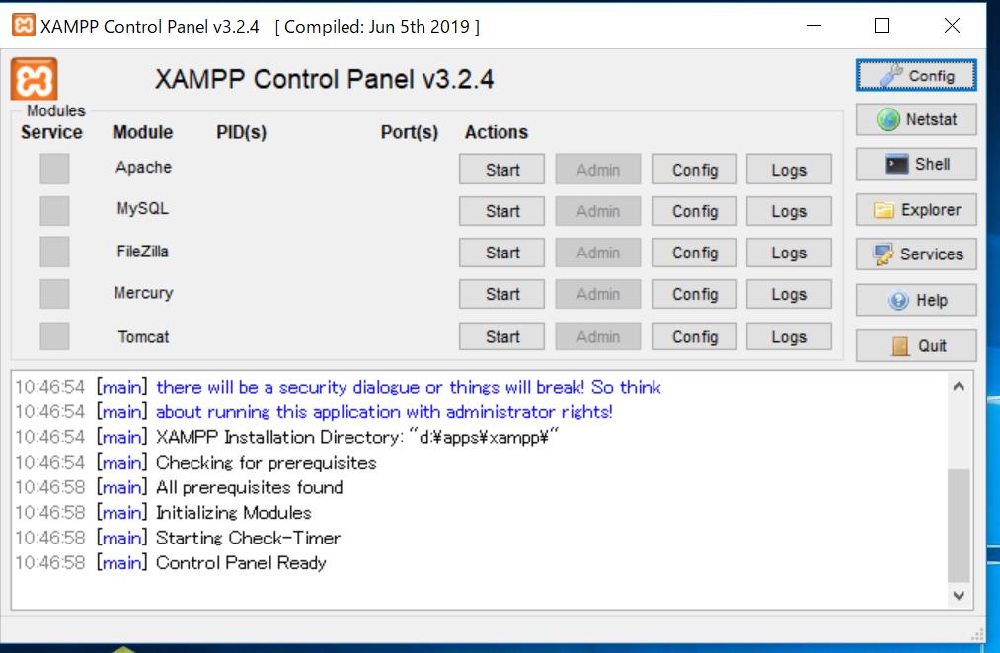
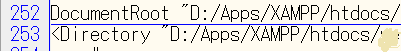

# サーバーとクライアントの関係

ウェブアプリケーションを作成、実装しようとしたときに、理解に困るのが「サーバー」と「クライアント」だと思われます。「サーバー」と「クライアント」という言葉はよく聞くけど実装しているときにどんな関係があるのか？
これを目に見えるように解剖したいと思います。

## サーバーってなに？
**大まかな話**
サーバーとは、早い話が「常駐アプリケーション」のことです。常駐(画面に見えなくても裏側で動いている)アプリケーションなので、目に見えないアプリケーションです。

それに対して、目に見えるアプリケーションがクライアントになります。

### サーバーの役目
ウェブアプリケーションでのサーバーは、まさに「この人がいないとはじまらない。」というほど大事な部分を担っています。

通常、ウェブアプリケーションを使用するときは携帯や、PCで特定のURLにアクセスして利用します。

具体的には、以下のような手順を行います。
1. Chrome(ブラウザ)でhttps://zenryokuservice.comにアクセスします。
2. アクセスしたURLは、サーバーが起動しているIPアドレスの参照を示します。
3. サーバーはリクエストを受けてレスポンスを返します。

この時にやり取りする情報(メッセージ)をHTTPメッセージと呼びます。
1. クライアントからサーバーへのメッセージをリクエストと呼ぶ。
2. リクエストに対してサーバーがクライアントに向けて送るメッセージをレスポンスと呼ぶ。


具体的には、以下のようなケースで説明します。

#### 前提
1. XAMPPを使用して起動するPHPアプリケーションを考える
2. WebサーバーはApache, DBサーバーはMySQLを使用している

### ドキュメントルート


XAMPPを起動したときに、Apacheの行にあるConfigをクリックすると設定ファイル(httpd.conf)を開けるので
ドキュメントルートの指定を確認、変更する。


「Document Root」と記述している行でドキュメントルートを指定している。
XAMPPの場合は**htdocs**がデフォルトでドキュメントルートに設定されている。

このドキュメントルートに、index.htmlファイルがあったとします。

URL ```localhost/index.html```でこのファイルにアクセスする事ができます。

フォルダ構成としては、「C:Apps\\XAMMP\\htdocs」となっているとします。
httpd.confには、下のような記述があるはずです。

```httpd.conf
#
# DocumentRoot: The directory out of which you will serve your
# documents. By default, all requests are taken from this directory, but
# symbolic links and aliases may be used to point to other locations.
#
DocumentRoot "C:/Apps/XAMPP/htdocs"
<Directory "C:/Apps/XAMPP/htdocs">
```

XAMPPをインストールするときにAppsフォルダの下を指定したのでこの様になりました。

#### DocumentRootのまとめ
1. サーバーは目に見えない裏側で動くアプリケーション
2. クライアントは目に見える表側で動くアプリケーション
3. クライアント側はブラウザで表示
4. サーバー側は、コマンドプロンプトなどで状態などを表示できる
5. サーバーを起動するとドキュメントルートが「localhost」で表示するファイルを配置するディレクトリになる
⇒DocumentRootは「localhost直下」になる。

## PHPファイルの見た場合
PHPファイルにはややこしいことに以下のプログラムが同居しています。
* サーバーサイドプログラム(PHP)
* クライアントサイドプログラム(HTML, JS)

具体的には下のようなものです。

```PHP
<?php
	if (!empty($_SERVER['HTTPS']) && ('on' == $_SERVER['HTTPS'])) {
		$uri = 'https://';
	} else {
		$uri = 'http://';
	}
	$uri .= $_SERVER['HTTP_HOST'];
	header('Location: '.$uri.'/dashboard/');
	exit;
?>
<!DOCTYPE html>
<html>
  <head>
    <meta charset="utf-8">
  <title>PGBox Top Page</title>
  </head>
  <body ng-app= "pgBoxAG" class="bg-light"  ng-controller="pgboxCtrl">
  あなたがアクセスしたURLは<?php print $url; ?>です。
  </body>
</html>
```

細かい話をすると、以下のようになります。
1. サーバー側でPHPの処理が走る
2. PHPがHTMLを出力
3. 出力したHTMLをPC側で受信
4. ブラウザで表示

## WordPressを使った場合
多くの人が利用しているWordPress、略して「WP」と記載します。

PHP + MySQLで動くCMSで、ウェブサーバーに配置、ブラウザからインストール入力を行うことで使用することが可能になります。

ディレクトリ構成としては、ドキュメントルート直下にインストールすることが多いようです。
インストール先```XAMPP/htdocs/WordPress```

この様にWPをインストールした場合、ローカルであれば「**localhost**」でブラウザからアクセスすればWPを開くことができます。

逆に「```XAMPP/htdocs/web/WordPress```」とした場合はどうでしょうか？

そうです。「**localhost/web/**」とアクセスしたときにWPを開くことができます。

これは、ドキュメントルートはWP用ではなく、HTML+JS+PHPでの実装をしたかったのでこの様にWPを一階層下げました。

[作成したもの](https://zenryokuservice.com/)としては、以下のようなものがあります。
・サイトマップ(index.html)
・基本情報技術者試験問題(!#/kihonjoho)
・楽天APIでの、商品読み込みと表示(JSでAPIを使用して、データの読み込み)
