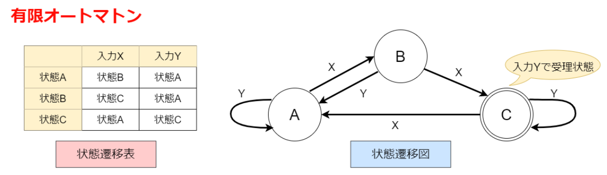

# ソフトウェア

## ソフトウェアの分類

|名前|別名|説明|
| -- | -- | -- |
| OS | 基本ソフトウェア| オペレーションシステム |
| Application | 応用ソフトウェア | アプリケーション |
| ミドルウェア | OSとアプリケーションの間に入るソフトウェア、DB管理ツール、通信管理システム、IPモニタなど|

## OS(基本ソフト)

|名前|説明|
| -- | -- |
| Windows | Microsoft社の出すOS|
| UNIX | 有償ソフト、Linuxの前身|
| Linux | オープンソースソフトウェアのOS、多くのディストリビューションがある。UBUNTSU, FedreaCore, CentOS ... |
| macOS, iOS | Apple社の出すOS, iOSはモバイル端末用のOS |
| Android | Google社の出すOS。ARMに対応しており、小さな基盤(マザーボード)でも使用が可能 |

### ミドルウェア

|名前|説明|
| -- | -- |
| Shell(シェル)|Linux, MacなどのOSで使用できるコマンドプログラム、Windowsの場合はコマンドプロンプト|
| WebAPI | リクエストを投げるとJSONで情報を返してくれる。CSV,XMLで返却する場合もある|
| ライブラリ | JAR, DLL, src.zipなどのソースを圧縮、配布、利用することができるようにしたもの |
| コンポーネントウェア| プログラムをオブジェクトとしてまとめ、実装されたもの|
| Java Beans | Java プログラムをコンポーネントとして扱う規約|
| ActiveX | Microsoft社の出す、コンポーネント、コンポーネント技術の総称 |
| CORBA | メッセージ交換の標準仕様、ネットワーク通信時に各サーバー間でメッセージの交換を行う |
| 開発フレームワーク | Struts, Springframework, Playなどアプリケーション実装の汎用的な処理を実装、体系化して利用することができる枠組みを持ったライブラリ群のこと|

### アプリケーション(応用ソフトウェア)

|名前|説明|
| -- | -- |
| ワープロ | ワードプロセッサ |
| 表計算 | エクセルのようなソフト |
| データベースソフト | DB管理ソフト |
|DPTソフト|印刷系のソフトウェア|
|グラフィックスソフト|ペイントツール、３DCGソフトなど|
|プレゼンテーションソフト|パワーポイントのようなソフト|
|グループウェア|組織内における共同作業を支援するソフト|

## OSS(Open Source Sorft wear)

|名前|説明|
| -- | -- |
| Webサーバー|Apache HTTP Server |
| DNSサーバー|BIND(IPアドレスとURLを関連付ける)|
| メールサーバー| sendmail|
|Webブラウザ|FireFox, Chrome|
|データベース|MySQL(MariaDB), PoestgreSQL|
|スクリプト言語|Riby, PHP, Python, Perl|
|統合開発環境|Eclipse, IntelliJ IDEA|
|LAMP/XAMP|Apacheウェブサーバー、MySQL、PHPがセットになったパッケージ。LAMPが古い|

## OSの機能

|名前|説明|
| -- | -- |
|ジョブ管理|人間から見た仕事(ジョブ)を管理する|
|タスク管理|機械から見た仕事(タスク)を管理する|
|記憶管理|記憶領域を有効に利用する回数|
|データ管理|補助記憶装置のデータへのアクセスを管理する|
|入出力管理|入出力装置のアクセスを管理する|
|ネットワーク管理|ネットワーク制御を管理する|
|運用管理|運用に関する容易性や制御を管理する|
|ユーザ管理|ユーザーに関する情報や制御を管理する|
|セキュリティ管理|セキュリティに関する情報や制御を管理する|
|障害管理|障害の検出、記録、対応に関して管理する|

### ジョブ管理処理で使う単語

|名前|説明|
| -- | -- |
|スプーリング|情報をメモリなどに一時保管しておき演算装置の処理が終わったら即データを渡せるようにすること<br>・バッファリングがプリンタなどのメモリ上で行う事<br>・スプーリングはハードディスクが行うことを指す|
|ジョブスケジューラー|ジョブをスケジューリングする、タイマー機能のように時間が来たら対象のジョブを実行する|
|FCFS方式|First-Come-First-Served、ジョブの到着順に実行すること|
|マスタスケジューラー|利用者とコンピュータとの間でジョブ実行管理を行う|

### ディスパッチャ
実行かの状態にあるタスクを選択(ディスパッチ)して実行するプログラム。実行するタスクを選択する基準はタスクスケジューリングの方法により決定する

#### プリエンプティブ方式
実行中のタスクがOSの制御により一時的に中断される方式

|名前|説明|
| -- | -- |
|優先度順方式|各タスクに割り当てられている優先度順にタスクを実行する|
|イベントドリブン方式|イベント(何かの操作、受信など)をきっかけとしてタスクを実行する方式|
|ラウンドロビン方式|実行可能状態のタスクを、到着順に管理、一定時間使っても終わらないタスクは処理を中断して最後尾に回す。|
|ノンプリエンプティ部方式|OSの制御により中断されない|

### セマフォ(semaphore)
複数のプログラムを並行して走らせるときにメッセージ制御、割り込み処理を行うための信号

### 記憶管理方法

|名前|説明|
| -- | -- |
|フラグメンテーション|分断、断片化、コンピュータ上でファイルが分散して保存されている状態|
|メモリコンパクション|断片化したメモリ使用領域を並べなおし、使用領域を増やします。|
|ガベージコレクション|使わなくなったメモリ領域を解放します|
|オーバーレイ方式(セグメント方式)|セグメントに分割して使用する方式|
|スワッピング|プログラムを補助記憶装置を用いてして処理する方法、一時的に補助記憶装置に退避=**スワップアウト**、逆は**スワップイン**|

### 仮想記憶管理
仮想記憶領域は、実際のハードよりも大きな論理的なメモリ領域を作り使用する。
物理メモリに対して、仮想メモリがあるということ。

|名前|説明|
| -- | -- |
|ページング方式|記憶領域を大きさで区切る方式|
|セグメント方式|記憶領域を役割や実行単位で区切る方式|
|セグメントページング方式|上記の合体|

### ページリプレースメントアルゴリズム
ページ置換アルゴリズムのこと、オンラインアルゴリズムの一種

#### オンラインアルゴリズム
入力全体を初めからアクセス可能にしなくても、先頭から順に処理を行えるアルゴリズム。

これに対しオフラインアルゴリズムもあり、それぞれの違いは以下のような違いがある
※どちらも実装は簡単だが、処理が遅いようだ。
* 挿入ソート：オンラインアルゴリズム
* 選択ソート：オフラインアルゴリズム

## プログラム言語と言語プロセッサ
**言語プロセッサとは**
> コンピュータ言語で書かれたデータを読み込んで処理・解釈し、別の言語やデータ構造による表現に変換するソフトウェアの総称。

**プログラム言語の分類**

|名前|説明|
| -- | -- |
|手続き型言語|演算命令やデータ操作命令などのを実行する「C言語,COBOL,Basic」|
|関数型言語|関数を入力データに作用させることによって出力データを得る|
|論理型言語|問題に内在する関係や条件などを論理式で記述する|
|オブジェクト指向型言語|データと処理を一体化した、オブジェクトを単位とする「Java, VB」|
|スクリプト言語|簡易プログラム(スクリプト)言語「JavaScript(JS), Ruby, Python, PHP」|
|マークアップ言語|SGML(DTD(Document Type Definition)で構造を定義), HTML, XML|

**言語プロセッサの種類**

|名前|説明|
| -- | -- |
|アセンブラ|コンピュータなどのプログラミング言語の1種で、原則として機械語の命令命令に1対1で対応した、人間に理解しやすい文字列や記号で記述される。|
|コンパイラ|C言語、COBOLのようなプログラムをコンパイルして機械語に翻訳する|

### マークアップ言語

|名前|説明|
| -- | -- |
|DTD|Document Type Difinition 文書構造（文書型）を定義するためのスキーマ言語の一つである。|
|SGML|ISOで標準化されている。DTDに書かれた内容でその文書構造が決定される|
|HTML|SGMLを拡張したもの、ホームページの作成にCSS,JavaScriptと合わせて使用される|
|DHTML|Dinamic HTML、HTMLの拡張で、JavaScript,VBScriptを埋め込める|
|XML|Extensible Markup Language、DTDの代わりにXMLスキーマを使用することもある。下記表を参照|
|XHTML|HTMLをXMLで再定義したもの|

#### XML関連技術

|名前|説明|
| -- | -- |
|XMLパーサ|DOM(Document Obuject Model)とSAX(Simple API for XML)がある|
|SOAP|XMLをベースにしたメッセージ交換プロトコル|
|SVG|XMLをベースにした2次元グラフィックス画像形式|
|WSDL|Webサービスを外部のソフトウェアから接続・利用するための仕様（インターフェース）を記述することができる言語(Web SDL)、昔はSDLだった|
|Ajax|ブラウザとサーバーで同期をとらずにXML文書を送受信して動的に画面を再描画する技術|

### コンパイラの処理
1. 字句解析: 単語に分解する
2. 構文解析: プログラム言語の文法に沿っているか解析する
3. 意味解析: 中間コードを生成する
4. 最適化: 中間コードの式などを簡略化
5. コード生成: 機械語、またはオブジェクトコード(実行するコード)に変換する

#### 1. 字句解析
正規表現や有限オートマトンを使用して解析する。

##### 正規表現
下のような形で、文字列指定することで、文字列の抽出、選択します。

```
[a-zA-Z] => 文字列「a」から「z」、「A」から「Z」の間の1文字を指定する
```


<table><caption class="textGray">基本的な正規表現</caption><tbody><tr><th class="w100px">文字</th><th>説明</th><th class="w120px">正規表現の例</th><th class="w120px">マッチする例</th></tr><tr><td class="tdtc"><code>.</code></td><td class="tdtl"><b>任意の１文字</b> にマッチします。</td><td class="tdtl"><code>.</code></td><td class="tdtl"><code>Ａ</code><br>あ</td></tr><tr><td class="tdtc"><code>+</code></td><td class="tdtl">直前の文字が <b>１回以上</b> 繰り返す場合にマッチします。<br><b>最長一致</b>。条件に合う最長の部分に一致します。</td><td class="tdtl"><code>go+gle</code></td><td class="tdtl"><code>gogle<br>go...gle</code></td></tr><tr><td class="tdtc"><code>*</code></td><td class="tdtl">直前の文字が <b>０回以上</b> 繰り返す場合にマッチします。<br><b>最長一致</b>。条件に合う最長の部分に一致します。</td><td class="tdtl"><code>go*gle</code></td><td class="tdtl"><code>ggle<br>go...gle</code></td></tr><tr><td class="tdtc"><code>?</code></td><td class="tdtl">直前の文字が <b>０個か１個</b> の場合にマッチします。<br><b>最長一致</b>。条件に合う最長の部分に一致します。</td><td class="tdtl"><code>go?gle</code></td><td class="tdtl"><code>ggle<br>gogle</code></td></tr><tr><td class="tdtc"><code>+?</code></td><td class="tdtl">直前の文字が <b>１回以上</b> 繰り返す場合にマッチします。<br><b>最短一致</b>。条件に合う最短の部分に一致します。</td><td class="tdtl"><code>go+?gle</code></td><td class="tdtl"><code>gogle<br>go...gle</code></td></tr><tr><td class="tdtc"><code>*?</code></td><td class="tdtl">直前の文字が <b>０回以上</b> 繰り返す場合にマッチします。<br><b>最短一致</b>。条件に合う最短の部分に一致します。</td><td class="tdtl"><code>go*?gle</code></td><td class="tdtl"><code>ggle<br>go...gle</code></td></tr><tr><td class="tdtc"><code>??</code></td><td class="tdtl">直前の文字が <b>０個か１個</b> の場合にマッチします。<br><b>最短一致</b>。条件に合う最短の部分に一致します。</td><td class="tdtl"><code>go??gle</code></td><td class="tdtl"><code>ggle<br>gogle</code></td></tr><tr><td class="tdtc">|</td><td class="tdtl"><b>いずれかの条件 (OR条件)</b> として使われます。</td><td class="tdtl"><code>goog(le|ol)</code></td><td class="tdtl"><code>google<br>googol</code></td></tr><tr><td class="tdtc"><code>\</code></td><td class="tdtl">直後の正規表現記号を <b>エスケープ</b> します。</td><td class="tdtl"><code>go\+gle</code></td><td class="tdtl"><code>go+gle</code><br><br></td></tr><tr><td class="tdtc"><code>[...]</code></td><td class="tdtl">角括弧に含まれる<b>いずれか１文字</b>にマッチします。</td><td class="tdtl"><code>[abc]<br>[a-c]</code></td><td class="tdtl"><code>a, b, c</code></td></tr><tr><td class="tdtc"><code>[^...]</code></td><td class="tdtl">角括弧に含まれる<b>文字以外</b>にマッチします。</td><td class="tdtl"><code>[^abc]<br>[^a-c]</code></td><td class="tdtl"><code>a, b, c</code><br>以外の文字</td></tr><tr><td class="tdtc"><code>(...)</code></td><td class="tdtl">文字を１つのグループに<b>まとめる</b>ことができます。</td><td class="tdtl"><code>goog(le|ol)</code></td><td class="tdtl"><code>google<br>googol</code></td></tr><tr><td class="tdtc"><code>{n}</code></td><td class="tdtl">直前の文字の<b>桁数を指定</b>できます。</td><td class="tdtl"><code>a{3}</code></td><td class="tdtl"><code>aaa</code><br><br></td></tr><tr><td class="tdtc"><code>{n,}</code></td><td class="tdtl">直前の文字の<b>最小桁数のみ指定</b>できます。</td><td class="tdtl"><code>a{3,}</code></td><td class="tdtl"><code>aaa<br>aaaa...</code></td></tr><tr><td class="tdtc"><code>{n,m}</code></td><td class="tdtl">直前の文字の<b>最小桁数と最大桁数を指定</b>できます。<br><b>最長一致</b>。条件に合う最長の部分に一致します。</td><td class="tdtl"><code>a{3,4}</code></td><td class="tdtl"><code>aaa<br>aaaa</code></td></tr><tr><td class="tdtc"><code>{n,m}?</code></td><td class="tdtl">直前の文字の<b>最小桁数と最大桁数を指定</b>できます。<br><b>最短一致</b>。条件に合う最短の部分に一致します。</td><td class="tdtl"><code>a{3,4}?</code></td><td class="tdtl"><code>aaa<br>aaaa</code></td></tr></tbody></table>

##### [有限オートマトン](https://ja.wikipedia.org/wiki/%E6%9C%89%E9%99%90%E3%82%AA%E3%83%BC%E3%83%88%E3%83%9E%E3%83%88%E3%83%B3)とは
**意味**
有限個の状態と遷移と動作の組み合わせからなる数学的に抽象化された「ふるまいのモデル」
デジタル回路やプログラムの設計で使われることがあり、ある一連の状態をとったときどのように論理が流れるかを調べることができる。



**用途**
有限オートマトンは様々な問題に応用でき、半導体設計の自動化、通信プロトコル設計、構文解析などの工学面での応用がある。生物学や人工知能研究では状態機械（群）を使って神経系をモデル化し、言語学では自然言語の文法をモデル化したりする。[参考サイト](https://itmanabi.com/automaton/)


#### 2. 意味解析
・プログラム言語の文法(BNF)

|式|説明|
| -- | -- |
|::=|左側に書かれた要素の構文を右側に定義する|
|<>|まぎらわしさを無くすための区切り|
|\\|どちらかを選択する（選択）|
|［］|これで挟まれる要素は有ってもなくても良い（省略）|
|･･･|直前の要素を反復する|
|＊|ZERO|回以上の繰り返し|
|＋|１回以上の繰り返し|
|？|直前の要素があってもなくても良い|
|‘‘|文字や文字列そのものを表す|

> ＜数字＞::＝ 0｜1｜2｜3｜4｜5｜6｜7｜8｜9
　＜英字＞::＝ A｜B｜C｜D｜E｜F
　＜英数字＞::＝＜英字＞｜＜数字＞｜_
　＜変数名＞::＝＜英字＞｜＜変数名＞＜英数字＞

上のようなBNF記法で書かれた定義があったとします。それは以下のような意味です。

1. 「＜数字＞」は「0｜1｜2｜3｜4｜5｜6｜7｜8｜9」で定義される
2. 「＜英字＞」は「A｜B｜C｜D｜E｜F」で定義される
3. 「＜英数字＞」は「＜英字＞」または「＜数字＞」または「_」
4. 「＜変数名＞」は「＜英字＞」「＜変数名＞(ここでは＜英字＞がセットされている)」または「＜英数字＞」

のように定義されます。他にも「構文図式」「構文木」があります。[参考サイト](https://www.k-fix.jp/skill/it/01/page25.html)

* 構文図式


* 構文木([参考サイト](https://ja.wikipedia.org/wiki/%E6%A7%8B%E6%96%87%E6%9C%A8))


#### 意味解析
* 四つ組み形式(三番地文)
コンパイラで構文解析した結果の表現方法の一つに4つ組み形式があります。
(演算子,被演算子1,被演算子2,結果)
この形式は、被演算子1と被演算子2に演算子を作用させたものが結果であることを表わします。

* 逆ポーランド記法
数式の記述方法で、演算子を被演算子の後に記述する表記法です。
