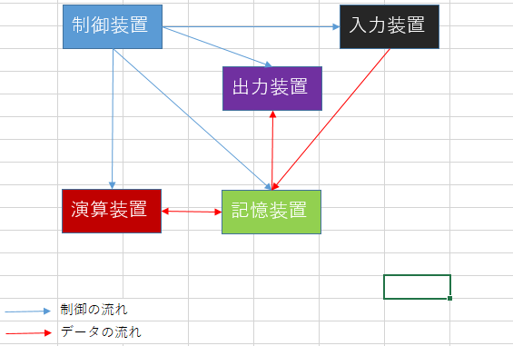

## ハードウェア
### 1-1 コンピュータの種類

| 世代: 西暦| 代表的なコンピュータ |
| ---- | ----------------- |
| 1: 1940年～ |【論理素子：真空管】・ENIAC(1946年), EDSAC(1949年) |
| 2: 1950年～ |【論理素子：トランジスタ】・UNIVAC(1951年), EDSAC(1949年) |
| 3: 1960年～ |【論理素子：IC(集積回路(Integrated Circuit))】・IBM/360(1964年) |
| 3.5: 1970年～ |【論理素子：LSI(Large Scale Integration): 大規模集積回路】 ・制御用コンピュータ ・マイクロプロセッサ ・スーパーコンピューター ・マイクロコンピュータ(マイコン) |
| 4: 1980年～ |【論理素子：VLSI(Very LSI)】・個人に一台のPCに変化 |
| 次世代:1 ？年～ |【論理素子：？】・さらなる発展 |

#### パーソナルコンピューター
通常のデスクトップ、ノートパソコン

#### サーバ
サーバー機、スペックが高い。タワー型、ラックマウント型(ユニット型を差し込む)、ブレード型

#### 携帯端末
ガラケー、スマホ、タブレット、ウェアラブルコンピューター(スマートウォッチ、スマートグラス)

#### マイコン(マイクロコンピュータ)
電子ジャーなどの家電に組み込まれている、ゲーム機のコントローラにも使用されている。
LSIや、VLSIが使用されている。

### 1-2 コンピュータの5大要素
1. 入力装置: データを入力する装置
2. 出力装置: 人間にわかる形で出力する装置
3. 記憶装置: 主記憶装置、補助記憶装置がある
4. 演算装置: 制御装置の指示に従い処理を行う
5. 制御装置: ほかの4つの装置に指示を行う

2-1 データの表現

2-2 基数と奇数変換

2-3 データの表現形式

3-1 中央処理装置の構成
CPUには、中央処理装置と制御装置が入っている。

ストアドプログラム方式のコンピュータアーキテクチャを持ったコンピュータ
> ノイマン型コンピュータとは、プログラムをデータとして記憶装置に格納し、これを順番に読み込んで実行するコンピュータ。現在のコンピュータのほとんどがこの方式を採用している。「コンピュータの父」とも呼ばれるアメリカの数学者、ジョン・フォン・ノイマン（John von Neumann）の名に由来する。

現代で流通しているPCは、この方式を採用しており、この方式(アーキテクチャ)では

1. 主記憶装置にあるプログラムを中央処理装置に読み込み
2. 制御装置が各装置に支持を出す

3-2 主記憶装置の構成

3-3 命令とアドレッシング

3-4 ALUの構成回路

3-5 高速化技術

4-1 磁気ディスク

4-2 光ディスク

4-3 半導体メモリ

4-4 そのほかの補助記憶装置

5-1 入力装置

5-2 出力装置

5-3 そのほかの入出力装置

5-4 入出力制御方式

5-5 入出力インターフェース
