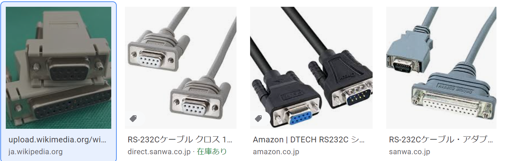
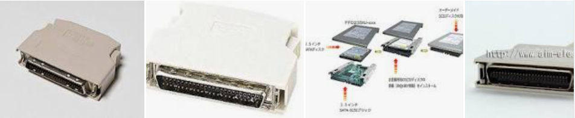
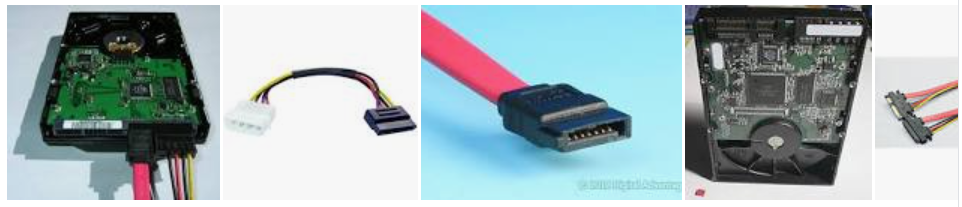
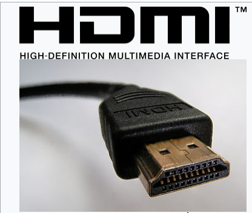

## イントロダクション
基本情報技術者試験は「考える事」よりも「暗記する事」の方が多いように思えたので、ここのページにまとめることにしました。

### 基本情報学習 Index
A. ハードウェア
 * 1-1. コンピュータ5大装置
 * 1-2. コンピュータの5大要素
 * 2-1. データの表現 ※[理解が必要のため別記事](https://zenryokuservice.com/wp/2021/01/04/%e5%9f%ba%e6%9c%ac%e6%83%85%e5%a0%b1%e6%8a%80%e8%a1%93%e8%80%85%e8%a9%a6%e9%a8%93-%e6%95%99%e7%a7%91%e6%9b%b8%ef%bd%9ejava%e3%81%a7%e7%90%86%e8%a7%a3%e3%81%99%e3%82%8b%ef%bd%9e/)
 * 2-2 基数と奇数変換 ※[同様に別記事](https://zenryokuservice.com/wp/2021/01/04/%e5%9f%ba%e6%9c%ac%e6%83%85%e5%a0%b1%e6%8a%80%e8%a1%93%e8%80%85%e8%a9%a6%e9%a8%93-%e6%95%99%e7%a7%91%e6%9b%b8%ef%bd%9ejava%e3%81%a7%e7%90%86%e8%a7%a3%e3%81%99%e3%82%8b%ef%bd%9e/)
 * 2-3 データの表現形式
 * 3-1 中央処理装置の構成
 * 3-2 主記憶装置の構成
 * 3-3 命令とアドレッシング
 * 3-4 ALUの構成回路(**論理回路**)

## 1-1 コンピュータの種類

| 世代: 西暦| 代表的なコンピュータ |
| ---- | ----------------- |
| 1: 1940年～ |【論理素子：真空管】・ENIAC(1946年), EDSAC(1949年) |
| 2: 1950年～ |【論理素子：トランジスタ】・UNIVAC(1951年), EDSAC(1949年) |
| 3: 1960年～ |【論理素子：IC(集積回路(Integrated Circuit))】・IBM/360(1964年) |
| 3.5: 1970年～ |【論理素子：**LSI(Large Scale Integration): 大規模集積回路】** ・制御用コンピュータ ・マイクロプロセッサ ・スーパーコンピューター ・マイクロコンピュータ(マイコン) |
| 4: 1980年～ |【論理素子：**VLSI(Very LSI)**】・個人に一台のPCに変化 |
| 次世代:1 ？年～ |【論理素子：？】・さらなる発展 |

#### パーソナルコンピューター
・通常のデスクトップ
・ノートパソコン

#### サーバ
・サーバー機、スペックが高い(コンピュータ)。
・タワー型
・ラックマウント型(ユニット型を差し込む)
・ブレード型

#### 携帯端末
・ガラケー, スマホ, タブレット
・ウェアラブルコンピューター(スマートウォッチ、スマートグラス)

#### マイコン(マイクロコンピュータ)
電子ジャーなどの家電に組み込まれている、ゲーム機のコントローラにも使用されている。
LSIや、VLSIが使用されている。
※LSI, VLSIは上の表を参照ください

## 1-2. コンピュータ5大装置
1. 入力装置: コンピュータに処理させるデータを入力する装置
・キーボード　・マウス　・イメージスキャナ
・デジタルカメラ　・ジョイスティックなど

2. 出力装置: 処理結果を人間に分かる形で出力する装置
・ディスプレイ（モニタ）　・プロジェクタ
・プリンタ　・プロッタ　・スピーカー
・イヤフォンなど

3. 記憶装置: データを記憶する装置
・ディスクドライブ　・フロッピーディスク（オフラインストレージとして使用）
・ハードディスクドライブ
・磁気テープ装置
・USBなど

4. 演算装置: 記憶されているデータを制御装置の指示に従い処理する装置
・ALU: 高速な加算器と任意の論理演算のための装置をうまくひとつにまとめたもの
・加算器: デジタル回路によるものは、ANDゲート、ORゲート、NOTゲートの組み合わせで作る
・乗算器: デジタルに乗算を実行する回路
・バレルシフタ: ある特定のビット数分だけワードデータをシフトできるデジタル回路である。
・FPU: 浮動小数点演算を専門に行う処理装置
5. 制御装置: 命令を解釈してほかの4つの装置に対して指示を出す装置

＜データの流れ図1＞

＜データの流れ図2＞

## 2-1. データの表現形式
**表現単位**
コンピュータ内部では、電気信号が「流れている」もしくは「流れていない」の2種類のみ表現できる。

この2つの状態を「0」「1」に対応させコンピュータ内部で保存する。

**情報量**

| データ量の単位 | データの例 |
| ------------- |---------- |
| ビット(bit) | 0, 1|
| バイト(byte) | 01010101(= 8bit) |
| ワード | 0101010101010101(= 16bit) |

＜大きな値＞

| 記号 | 読み方 | 10進数 | 2進数 |
| --- | ------ | ---- | ------ |
| k | キロ | 10の3乗(10e3) | 2の10乗 |
| M | メガ | 10の6乗(10e6) | 2の20乗 |
| G | ギガ | 10の9乗(10e9) | 2の30乗 |
| T | テラ | 10の12乗(10e12) | 2の40乗 |
| P | ペタ | 10の15乗(10e15) | 2の50乗 |
| E | エクサ | 10の18乗(10e18) | 2の60乗 |

＜小さな値＞
| 記号 | 読み方 | 10進数 |
| --- | ------ | ---- |
| m| ミリ | 10の-3乗(10e-3) |
| μ | マイクロ | 10の-6乗(10e-6) |
| n | ナノ | 10の-9乗(10e-9) |
| p | ピコ | 10の-12乗(10e-12) |

## 2-2 基数と基数変換
**2進数を10進数に変換する方法**
> 2進数の各ビットが1になっている部分を桁数-1乗し、合算する

※**2の2乗⇒2e2と表記**

例：「0101」(2進数)⇒「**(0 x 2e3) + (1 x 2e2) + (0 x 2e1) + (1 x 2e0)**」 = 「3」

**8進数を10進数に変換する方法**
2進数の時と同様に。。。

例：「0101」(8進数)⇒「**(0 x 8e3) + (1 x 8e2) + (0 x 8e1) + (1 x 8e0)**」 = 「65」

**r進数を10進数に変換する方法**
※**2の2乗⇒2e2と表記**し、桁数=「n」とする

各値e(n - 1) を合算する => 2進数「1010」であれば「(1 x 2e(4 - 1) + 0 x 2e(3 - 1) + 1 x 2e(2 - 1)  + 0 x 2e(1 - 1))」 = 10

**10進数をr進数に変換する方法**
* **整数部**：商が0になるまでnで除算を繰り返し、**後ろから並べる**

10進数「65」を8進数に変換する
 65 / 8 = 8 ... 1
 8 / 8 = 1  ... 0
 1 / 8 = 0  ... 1

* **小数部**: 計算結果の小数部が0になるまでnで乗算し、それぞれの計算結果を**前から並べる**
 10進数「0.6875」を8進数に変換する
 0.6875 x 8 = 5.5000 -> 5
 5.5000 x 8 = 4.0000 -> 4
 = 「0.54」

## 2-3 データの表現形式
コンピュータ内部dふぇは、すべてのデータを0, 1で表すが、これを下の様に人間に分かる形で「表現(表示)」する。

### データ
 * **文字データ**
 * 数値データ(10進数表記, 2進表記)
   * **10進数**
    * ・ゾーン10進数(アンパック10進数)
    * ・パック10進数
   * **2進数**
    * ・固定小数点数
    * ・浮動小数点数

### 文字データ

1byte(8bit)で表現される

| 文字コード | 16進表記 | 文字 |
| --------- | -------- | --- |
| 0100 1010 | 4A |  'J' |
| 0100 1001 | 49 |  'I' |
| 0101 1011 | 53 |  'S' |

### 数値データ
基数(2進数、10進数) ※[別記事詳細を記載](https://zenryokuservice.com/wp/2021/01/04/%e5%9f%ba%e6%9c%ac%e6%83%85%e5%a0%b1%e6%8a%80%e8%a1%93%e8%80%85%e8%a9%a6%e9%a8%93-%e6%95%99%e7%a7%91%e6%9b%b8%ef%bd%9ejava%e3%81%a7%e7%90%86%e8%a7%a3%e3%81%99%e3%82%8b%ef%bd%9e/)

## 3-1 中央処理装置(CPU)の構成
> 中央処理装置には、**制御装置** と **演算装置**が含まれる

ストアドプログラム方式(我々が使用する普通の方式)のコンピュータでは、以下のように動く
1. 主記憶装置に記録されている**プログラム**を中央処理装置に読み込む
2. 制御装置が各装置に指示を出す
3. 処理を実行する

**中央処理装置**
 * 制御装置
  * デーコーダ：実行命令を解釈する(命令解読器、複合器)
  * レジスタ：様々なデータを一時的に記録するための装置
   * 命令レジスタ: 実行する命令を格納する
   * 命令アドレスレジスタ(プログラムレジスタ): 次に実行する命令のアドレスを格納する
   * 汎用レジスタ: 処理対象となるデータを格納するなど、様々な用途に使用する
   * アキュムレータ: 演算を行うためのデータを格納する。
   * 指標レジスタ: あぢレス就職を行うための仕様を格納する。
   * フラグレジスタ: ある状態(演算結果が正か負か、など)の情報を格納する。フラグレジスタの状態により、条件分岐命令の分岐先などが決定される。
   * PSW(Program Status Word): プログラムの実行状態を格納する。= 「待機、実行、停止」
   * クロックジェネレータ: コンピュータ内部で、各装置間の動作タイミングをとるのに使用する**クロック信号**を発生させ**クロック周波数(MHz(メガヘルツ))**でその速さを表す。
   * バス: データの通り道、内部バス(CPU内のバス)、外部バス(システムバス、メモリバス、入出力バス)、拡張バス(PCIスロットなどの拡張カードの接続バス)
 * 演算装置
  * 加算器、補数器を使用したALU(算術論理演算装置)

## 3-2 主記憶装置の構成
記憶素子とは、主記憶装置やレジスタを構成する素子。IC(集積回路)を使用したメモリのことを**半導体メモリ**, **ICメモリ**と呼ぶ

| 型 | 説明 |
| -- | ---- |
| MOS型 | 集積度が高く消費電力も少ない、速度が若干遅い |
| CMOS型 | MOS型の改良版、これが主流となっている |
| バイポーラ型 | 高速だが、集積度が低く、消費電力が多い論理集積回路**TTL**がある |

### RAM（Random Access Memory)
データの読み書き可能なICメモリ(半導体メモリ)、データの長期保尊には向かない

| 名前 | 説明 |
| ---  | ---- |
| SRAM | 高速で高価、フロップリップ回路を使用し、レジスタなどに使用される。情報保持は電力が少ないが、読み書きは大きくなる |
| DRA< | 集積度が高く、大量生産に向いているれフレッシュが必要になる。SDRAM, DDR SDRAMがある。 |

### ROM(Read Only Memory)
| 名前 | 説明 |
| --- | ---- |
| マスクROM | 工場などでデータが記憶される、情報を参照するために使用される |
| ユーザープログラマブルROM | 利用者がデータを書き込めるROM |
| PROM | 紫外線を照射することで記憶内容の消去が可能なROM。 |
| UV-PROM | 紫外線を照射することで記憶内容の消去が可能なROM。 |
| EEPROM | E2PROMとも表記される。コンピュータなどの電子機器において、設定情報など、電源を切っても保持すべきデータの記憶に用いられる。 |
| フラッシュメモリ |  EEPROMの一種で持ち運びに便利 |

### 主記憶装置の構成要素
・記憶部：データを記憶するメモリセル(記憶素子)が配置されている。
・読み取り機構：記憶領域(メモリセルの集合)にあるデータの読み書きをする。
・アドレス選択機構：指定されたアドレスを解釈してデータの領域を選択する。

### 主記憶装置の容量拡張
拡張メモリ：SIMMやDIMMがある。
メモリカード：JEIDA(日本電子工業振興協会)やPCMCIA(雨居r化の業界団体)がある。

## 3-3 命令とアドレッシング
中央処理装置が主記憶装置から読み込む命令は**機械語**。

| 命令の種類 | 説明 |
| --------- | --- |
| 算術演算命令 | 加算減算を行う命令 |
| 論理演算命令 | 論理演算を行う命令 |
| 転送命令 | ロード・ストアなどのデータ転送を粉う命令 |
| 比較命令 | 二つの値を比較する命令 |
| 分岐命令 | シフト命令(算術シフト、論理シフトを行う)命令 |
| 入出力命令 | 入力装置または出力装置とデータのやり取りをする命令 |

### 命令の実行手順
①命令の取り出し段階(フェッチサイクル)と ②命令の実行段階(エグゼキューションサイクル)がある。

1. 命令取り出し(命令フェッチ)
2. 命令解読
3. 実行アドレス計算・オペランド(変数)取り出し
4. 演算(命令の実行)

### アドレスの指定方式
コンピュータのCPUが命令を実行する際に、対象となるデータのメインメモリ上での所在情報（アドレス、番地）を指定する方法のこと

### 割り込み

#### 外部割込み

| 割込み名 | 説明 |
| -------- | ------------------------ |
| タイマー割込み|タイマーによって割り込みを掛けること。
| 入出力割込み|入出力が完了したときなどに発生する。 また、入出力装置の故障や紙切れなど、入出力装置の状態が変化したときにも発生する。
| 機械チェック割込み|ハードウェアに異常が検出された際に発生する割り込みのことである。 主に処理装置や主記憶装置などが、誤動作、故障、電源異常などを起こした際に行なわれる。|
| リスタート割込み|外部から、オペレーターなどにより再起動がかけられたときに発生する割り込みのこと。|

## 3-4 ALUの構成回路
### 論理回路
[参考サイト](http://www.cs.shinshu-u.ac.jp/Lecture/LogicCirc/chap7/chap7.html)：論理回路記号とその変換

MIL記号では論理演算を下のように、書きます。ここは論理演算を図指揮すると下のように描けるというものです。深く考える必要はありません。

1. and(論理積)

2. nand(否定論理積)

3. or(論理和)

4. nor(否定論理和)
![NOR演算]

5. not(否定)

6. xor(排他的論理和)

#### 加算器(回路を組み合わせたもの)
1. 半加算器

2. 全加算器

### これらの図の意味を覚える
そのうえで、問題を解くという形で試験に臨む必要があると思った。

まだまだ、更新します。

## 補助記憶装置
* 内蔵HDD(ハードディスク)
* 外付けHDD(ハードディスク)
* 光ディスク
* USBメモリ
* SDカード

### 磁気ディスク装置(ハードディスク)
HDDは下のようにトラックを中心に、セクタ→トラック→シリンダと部位が分かれている。
> セクタ
トラックを等分割したもの
トラック
データの記録単位で、1周のことである
シリンダ
同心円状のトラックが集まったものである

#### 磁気ディスクの記録領域
| 呼び方 | またの名 | 意味 |
| ------ | ------- | --- |
| 論理レコード | レコード | 記憶する単位 |
| 物理レコード | ブロック | 記憶する単位 |
| ブロッキング | - | レコードをブロックにまとめること |
| ブロック化因数 | ブロック化係数 | ブロックにまとめたレコードの数 |

＜データの記録方式＞

| 呼び方 | 意味 |
| ------ | --- |
| バリアブル方式 | データの読み書きをブロック単位で行う方式、区切りとしてIBGを使用する |
| セクタ方式 | データの読み書きをセクタで行う方式。区切りとしてからのブロックを使用する。複数のセクタをかまとめて入出力単位とする**クラスタ**という概念を用いることもある |

#### 磁気ディスク装置の平均アクセス時間

| 呼び方 | またの名 | 意味 |
| ----- | -------- | --- |
| アクセス | - |データを読んだり書いたりする動作を |
| サイクルタイム | - | アクセス要求を受けてから次のアクセスを受けるまでの時間 |
| 位置決め | シーク | アクセスアーム(磁気ヘッド)を目的のトラック(シリンダ)まで移動する事 |
| 回転待ち | サーチ | 読み込むデータの先頭まで、磁気ヘッドが移動するのを待つ |
| データ転送 | - | 磁気ヘッドがデータを読み込む(書き込む)こと。 |

#### 光ディスク

| 書き込み方式 | 英語 | 意味 |
| ------ | ------- | --- |
| ディスクアットワンス | Disk At Onece | ディスク全体にまとめてデータを書き込む |
| トラックアットワンス | Track At Once| トラック単位でデータを書き込む |
| セッションアットワンス | Session At Once| セッション単位でデータを書き込む |
| マルチセッション | Multi Session| 1枚のディスクに複数のセッションを記録する |
| パケットライティング | Packet Writing| データをパケットという小さな単位で記録する |

#### 入出力装置

| カテゴリ | 名前 | 説明 |
| ------ | ------- | --- |
| ー | キーボード | キー入力 |
| ポスティングデバイス | マウス | ー |
| ポスティングデバイス | タッチスクリーン | ー |
| ポスティングデバイス | デジタイザ(タブレット) | ー |
| ポスティングデバイス | トラックボール | ー |
| ポスティングデバイス | タッチパッド | ー |
| ポスティングデバイス | ジョイスティック | ー |
| ポスティングデバイス | ライトペン | ー |
| 画像入力装置 | イメージスキャナ | ー |
| 画像入力装置 | デジタルカメラ | ー |
| 画像入力装置 | OCR | 手書きの文字や印刷されたものをデータとして取り込む |
| 画像入力装置 | OMR | マークしたものを絵データとして取り込む |
| 画像入力装置 | MICA | 小切手や、手形などをデータとして取り込む |
|その他| 生体認証装置 | 顔認証、指紋認証、など |
| その他 | バーコードリーダ |1次元バーコード、2次元バーコード(QRコード)|
| 音声入力 | マイク | 単一指向性マイク、全指向性マイク |
| カード読み取り装置 | カードリーダ | ICカード、磁気カードの読み取り |
| 通信制御装置 | LANインタフェースカード | ー |

#### 出力装置

＜解像度規格＞
| 名前 | 画面サイズ | 縦横比 |
| --- | ----- | ----- |
| VGA | 640 x 480 | 4 : 3 |
| SVGA | 800 x 600 | 4 : 3 |
| XGA | 1024 x 768 | 4 : 3 |
| SXGA | 1280 x 1024 | 5 : 4 |
| HD | 1280 x 720 | 16 : 9 |
| FHD | 1920 x 1080 | 16 : 9 |
| 4K(QFHD) | 1280 x 720 | 16 : 9 |
| 8K(FUHD) | 7680 x 4320 | 16 : 9 |

＜ディスプレイ＞
| 名前 | 英語 | 説明 |
| --- | ----- | ----- |
| 液晶ディスプレイ | LCD(Liquid Crystal Display) | 通常のディスプレイ |
| 有機ELディスプレイ | EL(ElectroLuminescence) | ー |
| プラズマディスプレイ | PDP(Plasma Display Panel) | ー |
| CRTディスプレイ    | Cathode Ray Tube) | ー |

#### 入出力

| 名前 | 英語 | 説明 |
| ---- | ---- | --- |
| USB  | Universal Serial Bus | mini USB, micro USBのタイプがあり、コネクタはTypeA, B, Cが存在する。機能として「バスパワード(電源)」「ホットプラグ(PCの電源を入れたままケーブルの着脱が可能)」「アイソクロナス転送(データ転送量を保証する転送方式)」がある。  |
| IEEE1394 | ー | Apple社のFirewire, ソニーのi.Linkがこれの商標名  |
| RS232C | ー |  |
| SCSI | ー |  |
| [IrDA](https://ja.wikipedia.org/wiki/IrDA) | ー | 赤外線通信すべてを意味しているわけではなく、情報機器等の通信を定めた物 |
| Bluetooth | ー | 無線技術の規格 |
| シリアル ATA | Serial ATA | ハードディスクの接続に使用する  |
| HDMI | ー　|　TVとゲーム機など接続、画面に表示、音声も送信する  |

#### デバイスドライバ

| 名前 | 英語 | 説明 |
| ---- | ---- | --- |
| デバイスドライバ | Device driver | 周辺機器(デバイス)を制御するソフトウェア、Windowsの場合、デバイスマネージャで管理できる。接続して使用するためのソフトウェア |
| BIOS | Basic Input/Output System | ファームウェアの一つで、コンピュータに搭載されたプログラムのうち、ハードウェアとの最も低レベルの入出力を行うためのプログラムである。|
| プラグアンドプレイ | Plug and play | 「差し込んで使う」という意味。パソコンに周辺機器や拡張カードを接続すると、OSが自動的に必要な設定を行う仕組みのこと。 |

<iframe src="https://docs.google.com/forms/d/e/1FAIpQLScyTAlvOfcEUxkCpduPS_Ac3oIYXagZgLbLO5R43JDdxhqnGQ/viewform?embedded=true" width="640" height="522" frameborder="0" marginheight="0" marginwidth="0">読み込んでいます…</iframe>
