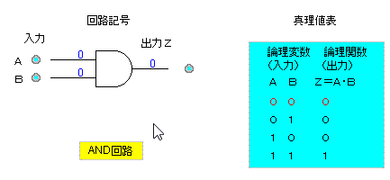
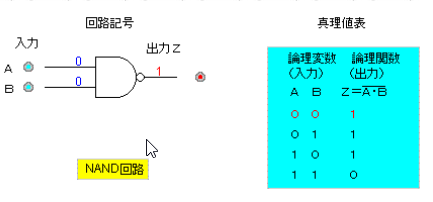

## ハードウェア
### 1-1 コンピュータの種類

| 世代: 西暦| 代表的なコンピュータ |
| ---- | ----------------- |
| 1: 1940年～ |【論理素子：真空管】・ENIAC(1946年), EDSAC(1949年) |
| 2: 1950年～ |【論理素子：トランジスタ】・UNIVAC(1951年), EDSAC(1949年) |
| 3: 1960年～ |【論理素子：IC(集積回路(Integrated Circuit))】・IBM/360(1964年) |
| 3.5: 1970年～ |【論理素子：LSI(Large Scale Integration): 大規模集積回路】 ・制御用コンピュータ ・マイクロプロセッサ ・スーパーコンピューター ・マイクロコンピュータ(マイコン) |
| 4: 1980年～ |【論理素子：VLSI(Very LSI)】・個人に一台のPCに変化 |
| 次世代:1 ？年～ |【論理素子：？】・さらなる発展 |

#### パーソナルコンピューター
通常のデスクトップ、ノートパソコン

#### サーバ
サーバー機、スペックが高い。タワー型、ラックマウント型(ユニット型を差し込む)、ブレード型

#### 携帯端末
ガラケー、スマホ、タブレット、ウェアラブルコンピューター(スマートウォッチ、スマートグラス)

#### マイコン(マイクロコンピュータ)
電子ジャーなどの家電に組み込まれている、ゲーム機のコントローラにも使用されている。
LSIや、VLSIが使用されている。

### 1-2 コンピュータの5大要素
1. 入力装置: データを入力する装置
2. 出力装置: 人間にわかる形で出力する装置
3. 記憶装置: 主記憶装置、補助記憶装置がある
4. 演算装置: 制御装置の指示に従い処理を行う
5. 制御装置: ほかの4つの装置に指示を行う

2-1 データの表現

2-2 基数と奇数変換

2-3 データの表現形式

## 3-1 中央処理装置の構成
CPUには、中央処理装置と制御装置が入っている。

ストアドプログラム方式のコンピュータアーキテクチャを持ったコンピュータ
> ノイマン型コンピュータとは、プログラムをデータとして記憶装置に格納し、これを順番に読み込んで実行するコンピュータ。現在のコンピュータのほとんどがこの方式を採用している。「コンピュータの父」とも呼ばれるアメリカの数学者、ジョン・フォン・ノイマン（John von Neumann）の名に由来する。

現代で流通しているPCは、この方式を採用しており、この方式(アーキテクチャ)では

1. 主記憶装置にあるプログラムを中央処理装置に読み込み
2. 制御装置が各装置に支持を出す

## 3-2 主記憶装置の構成
記憶素子とは、主記憶装置やレジスタを構成する素子。IC(集積回路)を使用したメモリのことを**半導体メモリ**, **ICメモリ**と呼ぶ

| 型 | 説明 |
| -- | ---- |
| MOS型 | 集積度が高く消費電力も少ない、速度が若干遅い |
| CMOS型 | MOS型の改良版、これが主流となっている |
| バイポーラ型 | 高速だが、集積度が低く、消費電力が多い論理集積回路**TTL**がある |

### RAM（Random Access Memory)
データの読み書き可能なICメモリ(半導体メモリ)、データの長期保尊には向かない

| 名前 | 説明 |
| ---  | ---- |
| SRAM | 高速で高価、フロップリップ回路を使用し、レジスタなどに使用される。情報保持は電力が少ないが、読み書きは大きくなる |
| DRA< | 集積度が高く、大量生産に向いているれフレッシュが必要になる。SDRAM, DDR SDRAMがある。 |

### ROM(Read Only Memory)
| 名前 | 説明 |
| --- | ---- |
| マスクROM | 工場などでデータが記憶される、情報を参照するために使用される |
| ユーザープログラマブルROM | 利用者がデータを書き込めるROM |
| PROM | 紫外線を照射することで記憶内容の消去が可能なROM。 |
| UV-PROM | 紫外線を照射することで記憶内容の消去が可能なROM。 |
| EEPROM | E2PROMとも表記される。コンピュータなどの電子機器において、設定情報など、電源を切っても保持すべきデータの記憶に用いられる。 |
| フラッシュメモリ |  EEPROMの一種で持ち運びに便利 |

### 主記憶装置の構成要素
・記憶部：データを記憶するメモリセル(記憶素子)が配置されている。
・読み取り機構：記憶領域(メモリセルの集合)にあるデータの読み書きをする。
・アドレス選択機構：指定されたアドレスを解釈してデータの領域を選択する。

### 主記憶装置の容量拡張
拡張メモリ：SIMMやDIMMがある。
メモリカード：JEIDA(日本電子工業振興協会)やPCMCIA(雨居r化の業界団体)がある。

## 3-3 命令とアドレッシング
中央処理装置が主記憶装置から読み込む命令は**機械語**。

| 命令の種類 | 説明 |
| --------- | --- |
| 算術演算命令 | 加算減算を行う命令 |
| 論理演算命令 | 論理演算を行う命令 |
| 転送命令 | ロード・ストアなどのデータ転送を粉う命令 |
| 比較命令 | 二つの値を比較する命令 |
| 分岐命令 | シフト命令(算術シフト、論理シフトを行う)命令 |
| 入出力命令 | 入力装置または出力装置とデータのやり取りをする命令 |

### 命令の実行手順
①命令の取り出し段階(フェッチサイクル)と ②命令の実行段階(エグゼキューションサイクル)がある。

1. 命令取り出し(命令フェッチ)
2. 命令解読
3. 実行アドレス計算・オペランド(変数)取り出し
4. 演算(命令の実行)

### アドレスの指定方式
コンピュータのCPUが命令を実行する際に、対象となるデータのメインメモリ上での所在情報（アドレス、番地）を指定する方法のこと

### 割り込み

#### 外部割込み

| 割込み名 | 説明 |
| -------- | ------------------------ |
| タイマー割込み|タイマーによって割り込みを掛けること。
| 入出力割込み|入出力が完了したときなどに発生する。 また、入出力装置の故障や紙切れなど、入出力装置の状態が変化したときにも発生する。
| 機械チェック割込み|ハードウェアに異常が検出された際に発生する割り込みのことである。 主に処理装置や主記憶装置などが、誤動作、故障、電源異常などを起こした際に行なわれる。|
| リスタート割込み|外部から、オペレーターなどにより再起動がかけられたときに発生する割り込みのこと。|

## 3-4 ALUの構成回路
ALU(算術論理演算装置)は以下のカイロで構成される。

### 論理回路
論理演算を行う回路のことで真(1)と偽(0)の値を使用する

## 1.論理回路
[参考サイト](http://www.cs.shinshu-u.ac.jp/Lecture/LogicCirc/chap7/chap7.html)：論理回路記号とその変換

MIL記号では論理演算を下のように、書きます。ここは論理演算を図指揮すると下のように描けるというものです。深く考える必要はありません。

### 順序回路
代表的なのは**フリップフロップ回路**でSDRAMの記憶セルに使用されている。

1ビットの情報を保持（記憶）できる論理回路です。相補的に動作する２つのスイッチ素子から構成されており、入力が無い限り元の状態を保持します。フリップフロップにはさまざま回路構成があります。

※図は**MIL記号**

* 入力が(1, 0) のとき，出力も(1, 0)
* 入力が(0, 1) のとき，出力は(0, 1)
* Xa=1, Xb=1 と 同時に 2つの入力に1を入れることはない．
* 入力が(0, 0)　のときは， 直前の状態を維持して出力は変わらない．

### 組み合わせ回路
1. and(論理積)

2. nand(否定論理積)

3. or(論理和)

4. nor(否定論理和)

5. not(否定)

6. xor(排他的論理和)

### 算術演算回路
歩数表現を行うことで、減算処理を行う。つまり加算処理のみが動いている。

#### 半加算器

#### 全加算器

3-5 高速化技術

4-1 磁気ディスク

4-2 光ディスク

4-3 半導体メモリ

4-4 そのほかの補助記憶装置

5-1 入力装置

5-2 出力装置

5-3 そのほかの入出力装置

5-4 入出力制御方式

5-5 入出力インターフェース
