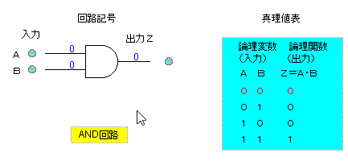
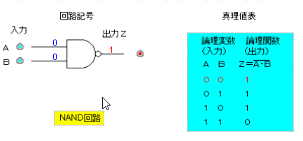
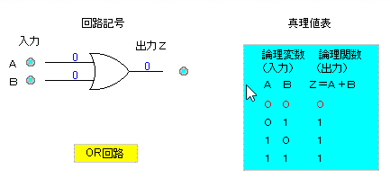
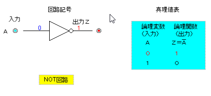
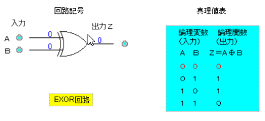
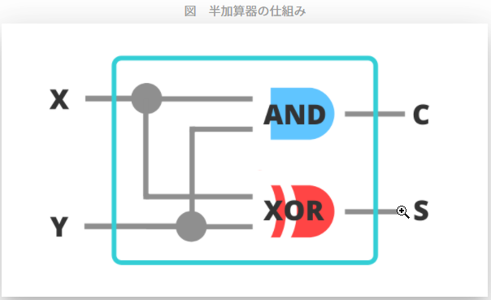
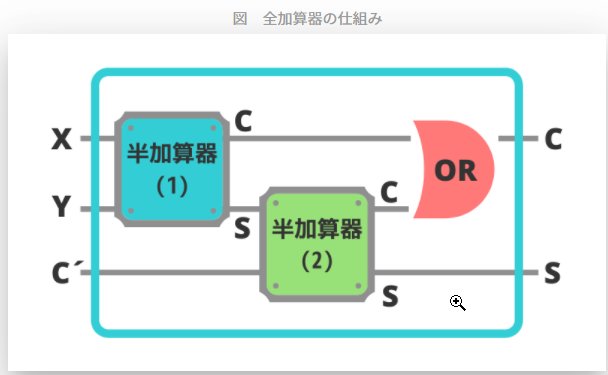

# 基本情報学習 Index
* 1.論理回路
* 2.確率・統計

## 1.論理回路
[参考サイト](http://www.cs.shinshu-u.ac.jp/Lecture/LogicCirc/chap7/chap7.html)：論理回路記号とその変換

MIL記号では論理演算を下のように、書きます。ここは論理演算を図指揮すると下のように描けるというものです。深く考える必要はありません。

1. and(論理積)

2. nand(否定論理積)

3. or(論理和)

4. nor(否定論理和)

5. not(否定)

6. xor(排他的論理和)

#### 加算器(回路を組み合わせたもの)
1. 半加算器

2. 全加算器

## 2.確率・統計
