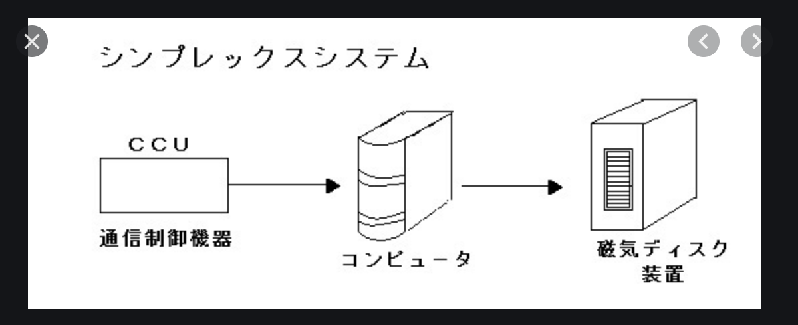
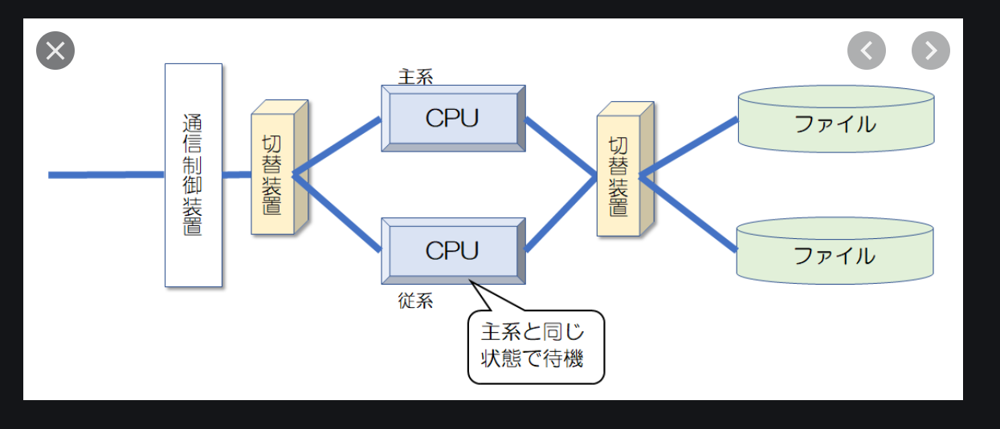

# 情報処理システムの形態

* 非対話型処理システム: 利用者は処理に介入できない
* 対話型処理システム: Windowsのような画面を使用して動かすシステム

| 名前 | 別名 | 説明 |
| ---- | ---- | --- |
| 一括処理システム | バッチ処理システム | コンピュータでひとまとまりのデータを一括して処理する方式。 |
| 即時処理システム | リアルタイム処理システム | 処理の要求を受けたら即動くシステム(リクエストを受けて動くシステムを含む) |

## 集中処理、分散処理システム
* **集中処理システム**：1か所に集中して処理を行うシステム
* **分散処理システム**：分散して処理を行うシステム

### 分散処理システムの種類

**出てくる単語一覧**

| 名前 | 英語 | 説明 |
| ---- | ---- | --- |
|　ピアツーピア | Peer to Peer | 対等な立場にあるコンピュータを並列につなぐ水平分散型。複数の機器やシステムで処理を分担する |
| クライアントサーバー | Client Server | 垂直分散型、サーバーとクライアントのように、各処理を担当するシステム、機能を分散しそれぞれの処理をコンピュータごとに行わせる |
| ファイルサーバー | File Server | ファイル管理用サーバー |
| データベースサーバー | Data Base Server | DB、DBを起動するサーバー |
| プロキシサーバー | Proxy Server | インターネットなどの外部ネットワークへの接続を行う、外部への接続ポイントをまとめるのでセキュリティ強化のために使用する |
| 3層クライアントサーバーシステム | ー | プレゼンテーション層(クライアント)、アプリケーション層(APサーバー)、データ層(DBサーバー)の3つに分けて実装する |
| ストアドプロシージャ | Stored procedure | DBのInsert(Create), Select(Read), Update, Delete -> 「CRUD(クラッド)」処理をスクリプトで実行する |
| シンクライアントシステム | Thin Client | リモートデスクトップ専用のコンピュータ、PC本体はほとんど機能を持っていくてもよい(ネットワーク接続ができる必要はある) |
| ウェブシステム | Web System | ウェブブラウザから処理を依頼するシステム、ECサイトなどがそれにあたる |

### クラウドコンピューティング
**概要**
インターネットなどのネットワークを経由して、外部組織が保有する情報システムから各種の情報処理サービスを受ける方法

下のような形でのサービスを提供する
**特徴**
* ユーザーインターフェースは主にウェブアプリケーションの形式で提供される。
* ユーザー側に必要なものは最低限の接続環境とパーソナルコンピュータや携帯情報端末などのクライアント、そしてサービス利用料金のみ

#### クラウドサービス
* **SaaS (Software as a Service)** - インターネット経由のソフトウェアパッケージの提供。電子メール、グループウェア、CRMなど。GoogleのGoogle Apps、マイクロソフトのMicrosoft Online Services、SAPのS/4HANA Cloud、SAP Business ByDesignやSAP SuccessFactors、SAP Ariba、セールスフォース・ドットコムのSalesforce CRM、オラクルの Oracle Cloudがある。オープンソースのSaaS構築フレームワークとしてはLiferayがある。

* **PaaS (Platform as a Service)** - インターネット経由のアプリケーション実行用のプラットフォームの提供。仮想化されたアプリケーションサーバやデータベースなど。ユーザーが自分のアプリケーションを配置して運用できる。GoogleのGoogle App Engine、AppScale、マイクロソフトのMicrosoft Azure、SAPのSAP Cloud PlatformやSAP HANA Enterprise Cloud、Amazon Web ServicesのAmazon S3やAmazon DynamoDBやAmazon SimpleDB、IBMのSoftLayer、セールスフォース・ドットコムのForce.comプラットフォームなど。

* **HaaSまたはIaaS (Hardware / Infrastructure as a Service)** - インターネット経由のハードウェアやインフラの提供。サーバー仮想化やデスクトップ仮想化や共有ディスクなど。ユーザーが自分でオペレーティングシステム (OS) などを含めてシステム導入・構築できる。Amazon Web ServicesのAmazon EC2・VMware Cloud on AWS、IBMのSoftLayerなど。

* **XaaS** - 上記の総称。

#### 並列処理システム
並列処理システムは、分散処理を並列して行う。これにより、処理時間の削減と大規模システムを実現する。

**種類**

| 名前 | 説明 |
| ---- | --- |
| マルチプロセッサシステム | 複数のコンピュータを組み合わせたシステムの総称。「マルチプロセッサ」というときは一台のコンピュータに複数のプロセッサ(プロセッサコア)が入っていることを示す |
| クラスタシステム | 複数のコンピュータを連携させて、全体を1台の高性能コンピュータであるかのように利用するシステム。 **負荷分散クラスタ構成**：ロードバランサにより負荷分散を行う。**HA(High Availability)クラスタ構成**：メイン機と、待機するサブ機を使用してサーバーダウンしないような形を実現する構成 |
|  グリッドコンピューティング | 広域に分散する多数のコンピュータをネットワークで結び並列処理することで仮想的に高性能なコンピュータとして使用するシステム(仕組み)。 **大規模並列処理**とも呼ばれヒトゲノムを解析するプロジェクトなどで使用している |

### 高信頼化システムの構成

#### 直列システム

| 名前 | 説明 |
| ---- | --- |
| シンプレックスシステム | オンライントランザクション処理における基本的な構成 情報システムの信頼性や構成法に関する用語で、冗長化などを行わず単一の系統だけでシステムを動作させること。 最も単純な構成で、どこかに障害が発生するとシステム全体が停止してしまう。  |
| タンデムシステム | 複数の処理装置やコンピュータを直列につなぎ、それぞれが特定の処理に注力して役割分担する構成のシステム 　|
| デュプレックスシステム | 1つの処理に対して2組のシステムを用意しておき、一方は障害が発生した際の予備機として待機させておく手法 |
