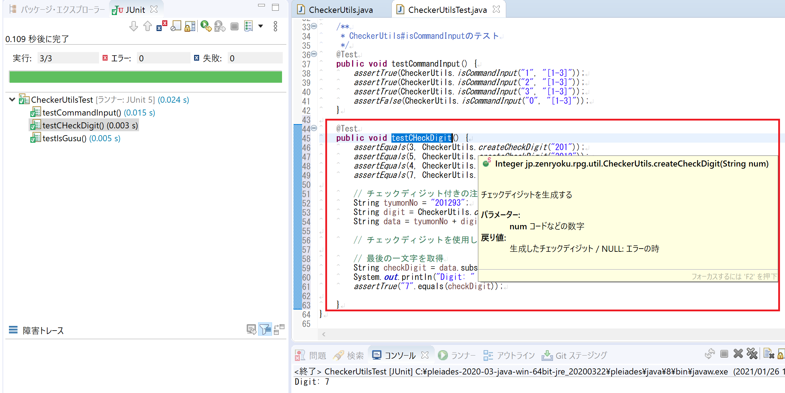

# 情報処理システムの形態

* 非対話型処理システム: 利用者は処理に介入できない
* 対話型処理システム: Windowsのような画面を使用して動かすシステム

| 名前 | 別名 | 説明 |
| ---- | ---- | --- |
| 一括処理システム | バッチ処理システム | コンピュータでひとまとまりのデータを一括して処理する方式。 |
| 即時処理システム | リアルタイム処理システム | 処理の要求を受けたら即動くシステム(リクエストを受けて動くシステムを含む) |

## 集中処理、分散処理システム
* **集中処理システム**：1か所に集中して処理を行うシステム
* **分散処理システム**：分散して処理を行うシステム

### 分散処理システムの種類

**出てくる単語一覧**

| 名前 | 英語 | 説明 |
| ---- | ---- | --- |
|　ピアツーピア | Peer to Peer | 対等な立場にあるコンピュータを並列につなぐ水平分散型。複数の機器やシステムで処理を分担する |
| クライアントサーバー | Client Server | 垂直分散型、サーバーとクライアントのように、各処理を担当するシステム、機能を分散しそれぞれの処理をコンピュータごとに行わせる |
| ファイルサーバー | File Server | ファイル管理用サーバー |
| データベースサーバー | Data Base Server | DB、DBを起動するサーバー |
| プロキシサーバー | Proxy Server | インターネットなどの外部ネットワークへの接続を行う、外部への接続ポイントをまとめるのでセキュリティ強化のために使用する |
| 3層クライアントサーバーシステム | ー | プレゼンテーション層(クライアント)、アプリケーション層(APサーバー)、データ層(DBサーバー)の3つに分けて実装する |
| ストアドプロシージャ | Stored procedure | DBのInsert(Create), Select(Read), Update, Delete -> 「CRUD(クラッド)」処理をスクリプトで実行する |
| シンクライアントシステム | Thin Client | リモートデスクトップ専用のコンピュータ、PC本体はほとんど機能を持っていくてもよい(ネットワーク接続ができる必要はある) |
| ウェブシステム | Web System | ウェブブラウザから処理を依頼するシステム、ECサイトなどがそれにあたる |

### クラウドコンピューティング
**概要**
インターネットなどのネットワークを経由して、外部組織が保有する情報システムから各種の情報処理サービスを受ける方法

下のような形でのサービスを提供する
**特徴**
* ユーザーインターフェースは主にウェブアプリケーションの形式で提供される。
* ユーザー側に必要なものは最低限の接続環境とパーソナルコンピュータや携帯情報端末などのクライアント、そしてサービス利用料金のみ

#### クラウドサービス
* **SaaS (Software as a Service)** - インターネット経由のソフトウェアパッケージの提供。電子メール、グループウェア、CRMなど。GoogleのGoogle Apps、マイクロソフトのMicrosoft Online Services、SAPのS/4HANA Cloud、SAP Business ByDesignやSAP SuccessFactors、SAP Ariba、セールスフォース・ドットコムのSalesforce CRM、オラクルの Oracle Cloudがある。オープンソースのSaaS構築フレームワークとしてはLiferayがある。

* **PaaS (Platform as a Service)** - インターネット経由のアプリケーション実行用のプラットフォームの提供。仮想化されたアプリケーションサーバやデータベースなど。ユーザーが自分のアプリケーションを配置して運用できる。GoogleのGoogle App Engine、AppScale、マイクロソフトのMicrosoft Azure、SAPのSAP Cloud PlatformやSAP HANA Enterprise Cloud、Amazon Web ServicesのAmazon S3やAmazon DynamoDBやAmazon SimpleDB、IBMのSoftLayer、セールスフォース・ドットコムのForce.comプラットフォームなど。

* **HaaSまたはIaaS (Hardware / Infrastructure as a Service)** - インターネット経由のハードウェアやインフラの提供。サーバー仮想化やデスクトップ仮想化や共有ディスクなど。ユーザーが自分でオペレーティングシステム (OS) などを含めてシステム導入・構築できる。Amazon Web ServicesのAmazon EC2・VMware Cloud on AWS、IBMのSoftLayerなど。

* **XaaS** - 上記の総称。

#### 並列処理システム
並列処理システムは、分散処理を並列して行う。これにより、処理時間の削減と大規模システムを実現する。

**種類**

| 名前 | 説明 |
| ---- | --- |
| マルチプロセッサシステム | 複数のコンピュータを組み合わせたシステムの総称。「マルチプロセッサ」というときは一台のコンピュータに複数のプロセッサ(プロセッサコア)が入っていることを示す |
| クラスタシステム | 複数のコンピュータを連携させて、全体を1台の高性能コンピュータであるかのように利用するシステム。<br>**負荷分散クラスタ構成**：ロードバランサにより負荷分散を行う。**HA(High Availability)クラスタ構成**：メイン機と、待機するサブ機を使用してサーバーダウンしないような形を実現する構成 |
|  グリッドコンピューティング | 広域に分散する多数のコンピュータをネットワークで結び並列処理することで仮想的に高性能なコンピュータとして使用するシステム(仕組み)。<br>**大規模並列処理**とも呼ばれヒトゲノムを解析するプロジェクトなどで使用している |


### 高信頼化システムの構成

#### 直列システム

| 名前 | 説明 |
| ---- | --- |
| シンプレックスシステム | オンライントランザクション処理における基本的な構成<br>情報システムの信頼性や構成法に関する用語で、冗長化などを行わず単一の系統だけでシステムを動作させること。 最も単純な構成で、どこかに障害が発生するとシステム全体が停止してしまう。  |
| タンデムシステム | 複数の処理装置やコンピュータを直列につなぎ、それぞれが特定の処理に注力して役割分担する構成のシステム 　|
| デュプレックスシステム | 1つの処理に対して2組のシステムを用意しておき、一方は障害が発生した際の予備機として待機させておく構成。よくあるサーバー構成。 |

### A.直列システム

#### デュプレックスシステム
> サーバー運用などでメインサーバー(主系)とサブサーバー(従系)を用意しておき、主系がダウンしたときに従系が起動する方式。
下のように3種類の状態がある。[こちらのサイト](https://itmanabi.com/duplex-dual-system/)を参考にしました。

1. ホットスタンバイ：主系が起動しているときに従系も同様に起動、同期している状態で運用するので、ダウンしたときは**すぐに従系が起動できる**。


2. コールドスタンバイ：切り替えに時間がかかる。従系は電源を切った状態で待機、ダウンしたときに従系を起動して切り替えるので**時間がかかる**。


3. ウォームスタンバイ：従系には、別のアプリケーションを起動させている状態。ダウンしたときに従系に切り替えるのに**時間がかかる**。


## デュアルシステム
> システムを２以上起動して、正常性を確認品がら処理を行う(クロスチェック)。医療系などの絶対にシステムを停止できないようなシステムに使用される。

## フォールトトレラントシステム
> その構成部品の一部が故障しても正常に処理を続行するシステムである。
フォールトトレラントシステムにおける障害復旧はロールフォワード（roll-forward）とロールバック（roll-back）に分けられる。

### マルチプロセッサ
> 一台のコンピュータシステムに複数のマイクロプロセッサ（CPU/MPU）を搭載すること。複数のプロセッサで異なるデータや命令を並列に処理することでシステム全体の処理能力を向上させることができる。

## RAID(レイド)

|名前|説明|
| -- | -- |
| RAID 0 | 複数のディスクにデータを分割して書き込みアクセス速度を向上したもの |
| RAID 1 | 片方のディスクと同じディスクを作成する(ミラーリング)ようにして、片方のディスクをバックアップ用にする |
| RAID 2 | データ保存用ディスクを複数台、データ修復用(**ハミング符号**)を用意してアクセス速度と信頼性を向上する |
| RAID 3 | データ保存用ディスクを複数台、データ修復用(**パリティ符号**)を用意してアクセス速度と信頼性を向上する |
| RAID 4 | RAID 3 では、ビット単位で行っていたこと(データアクセス)をセクタ単位で行うようにしたもの|
| RAID 5 | RAID 4 において、データ修復用のパリティディスクにあるデータ(パリティデータ)をデータ保存用のディスクに分散したもの |
| RAID 6 | RAID 5 においてデータ修復用のパリティ符号を2つ生成する方式 |


#### RAIDはネットワークストレージにも使用される
NAS: Network Attached Storage
SAN: Strage Area Network

## 情報処理システムの評価
**評価ポイント**
1. 処理能力の評価
2. システムの稼働率と故障率
3. 経済性の評価

### 1.処理能力の評価
* 処理能力の評価
* 信頼性の評価

#### 処理能力の評価
**システム全体の評価**：以下の評価指標を使用する。
1. 処理時間
2. 仕事量
3. CPU

##### 処理時間の評価
* ターンアラウンドタイム：処理を依頼してから、完全な出力結果を得られるまでの時間
= CPU処理時間 + 入出力時間 + 処理待ち時間など

* レスポンスタイム：システムに処理依頼が届いてから、結果の出力までの時間
= CPU処理時間 + 処理待ち時間など


##### 仕事量の評価
|名前|説明|例|
| -- | -- | -- |
|スループット | ー |1トランザクションにかかる時間<br>TPS (transactions per second: トランザクション数/秒) <br>または TPM (transactions per minute: トランザクション数/分) で測定されるのが普通です。|
|キャパシティプランニング|情報システムの設計段階で現状の最大負荷だけでなく、将来予測される最大負荷時にもサービスの水準を維持できるような設計を検討することです。| ステップ1: パフォーマンス目標の決定<br>ステップ2: パフォーマンス・メトリックの測定<br>ステップ3: システムのボトルネックの特定<br>ステップ4: キャパシティ管理計画の実施 |

##### CPUの評価

|名前|説明|
| -- | -- |
| クロック周波数 | 高いほど性能が良い
| MIPS(Million Instructions Per Second) | 100万単位での、1秒で実行できる命令数 = MIPS は、「 百万命令 ／ 秒」=> 「1MIPS = 100万命令/秒」|
| GIPS(Million Instructions Per Second) | 1秒で実行できる命令数 = MIPS は、**「 百万命令 ／ 秒」**|
| FLOPS(FLoating-point Operation Per Second) | 1秒で実行できる浮動小数点数演算数 = FLOPS は、「 百万命令 ／ 秒」=> **「1FLOPS = 10億命令/秒」**|

##### 性能測定技法
**ベンチマークテスト**
評価用標準プログラム使用して計測

|名前|ベンチマークの種類|
| -- | -- |
| TCPベンチマーク | [nuttcp](http://www.lcp.nrl.navy.mil/nuttcp/), [GoogleCodeのNDT](https://code.google.com/p/ndt/downloads/list), J2EE ベンチマークなど|
| SPECベンチマーク | SPEC(標準性能評価法人)、[CPUの性能指標と評価方法(日本OSS推進フォーラム)](http://ossforum.jp/node/770) |


#### 信頼性の評価
**故障に関する考え方**

|名前|説明|
| -- | -- |
| フォールトトレラント(耐故障技術) | システム設計の手法であり、システムの一部に問題が生じても全体が機能停止するということなく（たとえ機能を縮小しても）動作し続けるようなシステムを設計するものである。|
| フェールソフト | 故障箇所を切り離すなど被害を最小限に抑え、機能低下を許しても、システムを完全には停止させずに機能を維持した状態で処理を続行（縮退運転）する設計のこと|
| フォールトアボイダンス(故障排除技術) | システムや装置の信頼性についての考え方の一つで、なるべく故障や障害が生じないようにすること。 個々の構成要素の品質を高めたり、十分なテストを行ったりして、故障や障害の原因となる要素を極力排除することで信頼性を高めるという考え方。 |

**安全に対する考え方**

|名前|説明|
| -- | -- |
| フェールセーフ | 誤操作・誤動作による障害が発生した場合、常に安全に制御すること。 またはそうなるような設計手法で信頼性設計のひとつ。 これは装置やシステムが『必ず故障する』ということを前提にしたものである。 |
| フールプルーフ | 機器の設計などについての考え方の一つで、利用者が操作や取り扱い方を誤っても危険が生じない、あるいは、そもそも誤った操作や危険な使い方ができないような構造や仕掛けを設計段階で組み込むこと |

##### 信頼性の指標
**RASIS, RASという指標がある**
|指標|意味|
| -- | -- |
| Reliability(信頼性) | システムが正しく動いているか？ |
| Availability(可用性) | 使いたいときにシステムが稼働状態になっているか？ |
| Service ability(保守性) | 障害が発生したときに対処(回復)しやすいか？ | ー |
| Integrity(完全性) | データの正当性が保証されているか？ |
| Security(安全性) | システムやデータに対する機密保護が行われているか？ |

|名前|説明|
| -- | -- |
| MTBF(Mean Time Between Failures(平均故障動作時間)| システムが修復されてから次に故障するまでの時間 |
| MTTR(Mean Time To Repair(平均修理時間)) | システムが修復されてから復旧するまでの時間|
| 稼働率 | MTBF / (MTBF + MTTR)|
| 非稼働率 | 1 - 稼働率 |
| 故障率 | 「1 / MTBF」 もしくは、 「Σ装置単体の故障率」※Σは総和を示す|

#### 経済性の評価

|名前|説明|
| -- | -- |
| 初期コスト(Initial const) | ハードウェア、ソフトウェア、開発の合計費 |
| 運用コスト(Running const) | ハードウェアのリース(レンタル)、オペレータ、設備維持の費用 |

## ヒューマンインターフェース
システム利用者にとって大切なのは、以下のこと
* 使い勝手の良さ
* アクセスのしやすさ

|名前|説明|
| -- | -- |
| インフォメーションアーキテクチャ |  ユーザーにとって情報をわかりやすく・見つけやすくする技術全般を指します。<br>分類した情報のまとまりを**チャンク**、まとまりにつけた名前を**ラベル**と呼び、情報を改装上に分類・整理することを**タグ付け** |
| インタラクティブシステム | インタラクティブ(双方向)で情報のやり取りができるシステム |

#### 使用性の概念
**対話原則<[JIS Z 8520](https://kikakurui.com/z8/Z8520-2008-01.html)>**
ある製品が，指定された利用者によって，指定された利用の状況下で，指定された目的を達成するために用いられるときの，有効さ，効率及び利用者の満足度の度合い。を定義した規格

1. 仕事への 適合性
2. 自己記述性
3. ユーザーの 期待への一致
4. 学習への 適合性
5. 可制御性
6. 誤りに対して の許容度
7. 個人化への 適合性

#### インターフェースの種類

|名前|説明|
| -- | -- |
| 自然言語インターフェース | 音声認識を使用して会話形式で処理を進める |
| ノンバーバルインターフェース | 非音声言語を使用して人と機械とのコミュニケーションを取る、画像認識、動画認識、特徴量抽出などを利用する |
| GUI(Graphical User Interface) | 通常のPC画面のこと |

### インターフェース設計
##### 画面設計
**シュナイダーマンの8原則**
1. 一貫性を持たせる
2. 頻繁に使うユーザーには近道を用意する
3. 有益なフィードバックを提供する
4. 段階的な達成感を与える対話を実現
5. エラー処理を簡単にさせる
6. 逆操作を許す
7. 主体的な制御権を与える
8. 短期記憶領域の負担を少なくする

**フールプルーフ**
機器の設計などについての考え方の一つで、利用者が操作や取り扱い方を誤っても危険が生じない、あるいは、そもそも誤った操作や危険な使い方ができないような構造や仕掛けを設計段階で組み込むこと

**チェック内容一覧**

|名前|説明|
| -- | -- |
| ニューメトリックチェック | 数字検査 |
| リミットチェック | 限度検査 |
| フォーマットチェック | 書式チェック |
| 重複チェック | ー |
| 照合チェック | 取得したデータと取得元のデータを照合する |
| バランスチェック | 別々に集計した合計が一致しているか |
| 論理チェック | データが論理的に正しいか |
| シーケンスチェック | 番号が順番に並んでいるか |
| 組み合わせチェック | 入力された複数の関連項目の組み合わせに矛盾がないかチェック |
| チェックデジットチェック | 検査文字(チェックキャラクタ)を使用してチェックする |

##### 帳票設計
システムから出力される、報告書、伝票などの項目やレイアウトを設計する
**手順**
1. 総合的な検討：出力目的、出力周期、タイミング、配布先、出力量など
2. 出力方式、媒体の検討：紙、CD、PDFなど
3. 出力項目、帳票レイアウトの作成：プリンターやプリンターサーバーに保存しておき、原稿と重ね合わせて印刷する機能。フォームオーバーレイの使用も検討する。

**フォームオーバーレイ**
プリンターやプリンターサーバーに保存しておき、原稿と重ね合わせて印刷する機能。

### コード設計
データを分類するためのコードを定義する、都道府県コードや、大学コードのこと。コードに要求される4つの機能
1. 識別機能：データを区別する
2. 分類機能：データを分類する
3. 配列機能：データの順序を決定する
4. チェック機能：データが正しいことをチェックする

コードは以下のような種類がある

|名前|説明|例|
| -- | -- | -- |
| 順番コード |順番に割り当てる|都道府県コード| -- |
| 区分コード |各ブロック内で連番で割り当てる|大学コード<br>Ex 0: 国立{001: 東京大学, 一橋大学 ...} 1: 公立{都立大, 横浜市大 ...} 2: 私立{明治大, 慶応大 ...}|
|桁別番号|各行に意味を持たせる(1桁目: 種別, 2桁目: コース, 3～6桁目: 登録番号) | 前日コースの法人会員コード|
|表意コード|コード化するデータや名称や略称を使用|JP20CTV=日本製20インチカラーテレビ| -- |
|合成コード|コードを組み合わせる| -- |

### チェックディジット(検査数字)
入力した値が妥当かどうかの判定に使用する([参考](https://detail.chiebukuro.yahoo.co.jp/qa/question_detail/q11148341146)
> 本体の値を読み間違ってないか確認するために付加する数値です。簡単な例で言えば、本体の値が30196だったときに、3+0+1+9+6=19でチェックデジットを9、コードを301969とするようなものですね。字が汚くて801969と読み間違ったら、8+0+1+9+6=24の4なので9じゃないから読み間違った可能性が高いと診断する

チェック処理で使用することが多いのでプログラムの実装も交えて記載する。

＜チェックディジット使用例＞
入力値を「30196」としたときに、3+0+1+9+6=19と分割、合算、下一桁をチェックディジットとする。
入力値を「80196」と間違えた場合
8+0+1+9+6=24の4なので9じゃないから読み間違った可能性が高いと診断
※計算方法は一定の法則があればなんでもよい

＜チェックディジットの求め方＞
①コードの各桁に重みを乗算し各乗算した値を合計する。※重みとは、各桁に重みの値をつける
（例）コード＝"3612"として、左から順に重みを5, 4, 3, 2とする。
　　　(**3** x 5) + (**6** x 4) + (**1** x 3) + (**2** x 2) = **46**

②加算した結果を10で乗算、余りをチェックディジットとする
　（例）46 / 10 = 4 余り 6 -> **チェックディジット＝6**

チェックディジットの有名なものは下のようなものがある。

|名前|説明|
| -- | -- |
| モジュロ10/ウェイト3 | キャラクタに3,１,3,１とウェイトを掛けていき、キャラクタの総和が10の倍になる値を使用 |
| モジュラス10/ウェイト2 | キャラクタに2,1,2,1とウェイトを掛けていき、それらの総和が10の倍数になる値を使用 |
| セブンチェック（7DR及び7DSR） | 数値を７で割り、余りを使用する |
| ナインチェック（9DR及び9DSR） | 数値を9で割り、余りを使用する |
| ISBN-10 のチェックデジット | 旧体系の ISBN-10 は、「モジュラス11 ウェイト10-2」とも呼ばれる |


#### モジュロ10/ウェイト3
モジュロ10/ウェイト3は**数字のみのチェック方式**で、キャラクタに3,１,3,１とウェイトを掛けていき、キャラクタの総和が10の倍になる値をチェックデジットとする。

> 具体的には、数値をモジュラスで割って得られた余りをモジュラスから差し引いた数値（補数）をチェックデジットとする。JAN/EAN、UPC、インターリーブド2 of 5等に使用されている。その計算方法を次に示す。
>
> (1) データキャラクタの中で最も右にあるキャラクタを奇数とし、全てのデータキャラクタを奇数位置と偶数位置に分類する。
>
> (2) 奇数位置にあるキャラクタを3倍する。
>
> (3) 偶数位置にあるキャラクタを1倍する。
>
> (4) 手順(2)の結果と手順(3)の結果を合計する。
>
> (5) 手順(4)の結果を10で割り、余りを求める。
>
> (6) 10から手順(5)の結果の余りを引いた数字がチェックデジットである。なお、手順(5)の答えの余りが0の場合は、チェックデジットは0となる
>
> (7) インターリーブド 2 of 5は、データとチェックデジットの合計が偶数桁でなければならないので、奇数桁の場合は、データの前に0を付加する。
v
> 例：JAN-8のデータが4912349の場合のチェックデジットを求める。
> (1) データキャラクタの中で最も右にあるキャラクタを奇数とし、全てのデータキャラクタを奇数位置と偶数位置に分類する。
>
> (2) 奇数位置にあるキャラクタをそれぞれ3倍、偶数位置にあるキャラクタを1倍する。
>
> (3) 奇数位置と偶数位置の数字を合計する。
> 12+9+3+2+9+4+27＝66
>
> (4) (3)の結果を10で割り、余りを求める。
> 66÷10＝6余り6
>
> (5) 10から(3)の結果の余りを引く。
> 10－6＝4
>
vしたがって、このチェックデジットは4である。

#### 使い方
チェックディジットは、もともとある値につけてその値が正しいことを確認するために使用します。
> ※伝票番号「123456」のチェックデジットを「7DR」方式で求めます。
（1）そのまま、7で割ります。　・・・＝17636あまり4
（2）あまりの数字をチェックデジットとします。　・・・番号「123456」の7DR方式チェックデジットは「4」です。
（3）伝票番号に求めたチェックデジットを含め、実際に記載する番号は「1234564」となります。

DBに登録する番号を考えてみる。

注文テーブルを作成したとして、注文番号をDBに登録するとします。

この時に、「DBへ注文番号 + チェックディジット」の形で登録するとします。

そのようにすると、チェック付きのデータとして登録することができます。


下のコードは、以下のような処理を行っています。
1. 引数にある文字列が数字であるかチェック、そうでなければNULLを返却
2. 各文字をint型に変換して合算する
3. 合算した結果を10で割る
4. そのあまりを返却する

```java
/**
 * チェックディジットを生成する
 * @param num コードなどの数字
 * @return 生成したチェックディジット / NULL: エラーの時
 */
public static Integer createCheckDigit(String num) {
	if (num != null && !num.matches("[0-9]+")) {
		return null;
	}
	char[] ch = num.toCharArray();
	int gokei = 0;
	for (int i = 0; i < ch.length; i ++) {
		String val = String.valueOf(ch[i]);
		int valNum = Integer.parseInt(val);
		gokei += valNum;
	}
	int amari = gokei % 10;
	return amari;
}
```

テストコード

```
@Test
public void testCHeckDigit() {
	assertEquals(3, CheckerUtils.createCheckDigit("201"));
	assertEquals(5, CheckerUtils.createCheckDigit("2012"));
	assertEquals(4, CheckerUtils.createCheckDigit("20129"));
	assertEquals(7, CheckerUtils.createCheckDigit("201293"));

	// チェックディジット付きの注文番号生成
	String tyumonNo = "201293";
	String digit = CheckerUtils.createCheckDigit(tyumonNo).toString();
	String data = tyumonNo + digit;

	// チェックディジットを使用してチェックする

	// 最後の一文字を取得
	String checkDigit = data.substring(data.length() - 1);
	System.out.println("Digit: " + checkDigit);
	assertTrue("7".equals(checkDigit));

}
```



## ヒューマンインターフェースの技法
* Webデザイン
 1. Webユーザービリティ
 - 学習容易性
 - 効率性
 - 記憶性
 - エラー対応
 - 満足度
 2. Webアクセシビリティ
 - 知覚可能
 - 操作可能
 - 理解可能
 - 堅朗性(ロバスト性)
 3. スタイルシート(CSS)
 - フレーム：表示分割
 - クロスブラウザ：どのブラウザでも開ける
 - プログレッシブエンハンスメント：全てのブラウザで動作するようにすること
 4. ナビゲーション
 - サイトマップ
 - サイト内検索
 - パンくずリスト

## マルチメディア
文字、映像、画像、音声などの情報をデジタル化、インタラクティブ(双方向)性のある。


|名前|説明|
| -- | -- |
| CMS(Contents Management System) |  |
| ハイパテキスト |  |
| ハイパメディア |  |
| オーサリングツール | 画像，音声，文字などの素材となる様々なデータを編集して、１つのコンテンツを作成するためのソフトウェア |
| PDF(Portable Document Format) | アドビが開発および提唱する、電子上の文書に関するファイルフォーマット |
| ストリーミング | 画像などのファイルをダウンロードしながら才セすること |
| A/D変換 | アナログ/デジタル変換（PCMなどの技術がある |
| 標本化(サンプリング) | 連続信号を一定の間隔をおいて測定することにより、離散信号として収集することである。 |
| 量子化 | アナログ信号などの連続量を整数などの離散値で近似的に表現すること |
| 符号化 | デジタル処理・伝送・記録のための、情報のデジタルデータへの変換方式のことである。変換されたデータを符号と呼び、符号から元の情報へ戻すことを復号と呼ぶ |
| MIDI | Musical Instrument Digital Interface音楽を再生するための情報 |
| MP3 | ISOで規格化したMPEG形式で圧縮するファイル形式 |
| WAV | 主にWindowsで使用されている音声データ形式 |
| RGB | 光の3原色 |
| CMY | 色の3原色 |
| 解像度 | 1インチ当たりのドット数(dot per inch) |
| BMP | ビットマップ　静止画 |
| JPEG | ISO規格で圧縮した後に復元されないタイプの圧縮形式　静止画 |
| GIF | データ量が比較的小さい　静止画 |
| PNG | GIFを拡張したものJPEGよりもデータ量は多い　静止画 |
| Exif | デジタルカメラで撮影した画像データにメタ情報を追加して保存できる形式 |
