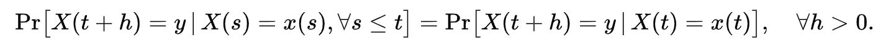
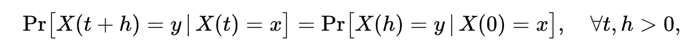

## 統計・確率
### マルコフ性（マルコフ性、英: Markov property）
確率論における確率過程の持つ特性の一種で、その過程の将来状態の条件付き確率分布が、現在状態のみに依存し、過去のいかなる状態にも依存しない特性を持つことをいう。すなわち、過去の状態が与えられたとき、現在の状態（過程の経路）は条件付き独立である。マルコフ性のある確率過程をマルコフ過程と呼び、主に以下のような種類がある。
* マルコフ連鎖: 数式で示すと下のような状態です。

* 連続時間マルコフ過程

### 意味
通常現れるマルコフ過程の分布は推移確率によって決定できる。マルコフ過程 Xt の推移確率とは時刻 s に状態空間の点 x を出発して、時刻 t > s に状態空間の(可測)部分集合 Y に入る確率 P(s, t; x, Y) のことであり、

> P(Xt+1∣Xt,Xt−1,…,X1)=P(Xt+1∣Xt)

で定義される。離散時間マルコフ過程の場合は t = s + 1 の場合の推移確率のみで十分であり、他の期間の推移確率は以下のチャップマン-コルモゴロフの等式により計算できる。時間的に一様な場合は、s = 0 の場合だけで十分であり、他の時刻の推移確率は P(s, t; x, Y) = P(0, t - s; x, Y) で計算できる。

さらに離散マルコフ過程の場合は Y のかわりに状態空間の一点 y を用いれば十分であり、その場合は推移確率は行列となる。

### マルコフ過程
> 未来の事象は現在の事象に依存し，過去の事象に依存しない。性質をもつもの。

マルコフ過程（マルコフかてい、英: Markov process）とは、マルコフ性をもつ確率過程のことをいう。すなわち、未来の挙動が現在の値だけで決定され、過去の挙動と無関係であるという性質を持つ確率過程である。

#### 固有ベクトル
1. 行列Aの固有方程式:det(A−λE)=0を未知数λの方程式として解いて固有値λを求める．

2. 各々の固有値を連立方程式: (A−λE)→x=→0に代入して，対応する固有ベクトル→xを求める．

> ある行列Aにベクトルxをかけた結果としてその定数倍になる場合，そのベクトルxを固有ベクトル，定数倍の値を固有値と呼ぶということ。
