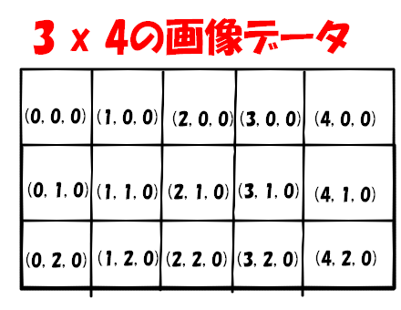
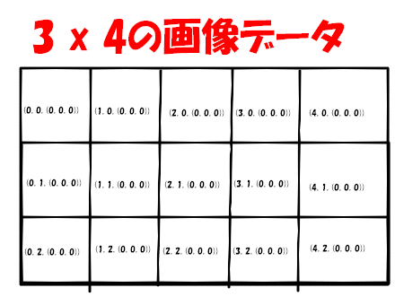

# 静止画処理

## 静止画の基本
画像データの持ち方：(X, Y, D)
1. X軸とY軸での座標を使用して表示する点の位置を決定する

2. D = 濃度の情報(8ビットであれば256階調)
 ※2進数で8ビットで並ぶと2の8乗=256

3. イメージとしては下のようなもの(8bit画像) ※白 = 0

4. よく聞く**RGB**は24bit画像で、**(X, Y, (R,G,B))**となる、画像がイマイチ。

### 濃度とか色に関して
* 8ビット画像では、0～256の色を選択する形
* 24ビット画像では、RGB(赤、緑、青)の濃度をせっていし、各色を表現する => (8bit, 8bit, 8bit)

### 画像処理ソフト
1. Adobe Lightroom
2. GIMP
3. Fotor
4. PIXLR EDITOR

### 画像処理ライブラリ
* **OpenCV**
※機械学習～背景補完などの処理APIが入っている
　静止画~動画を扱える

## 動画処理
1枚の画像を**フレーム**として扱い、1秒間に使用するフレームの数を**フレームレート**という。

以下、有名なファイル規格(拡張子)
| 名前 | 説明 |
| ---- | --- |
| JPEG | 画像圧縮、国際規格(動画用の圧縮規格) |
| MPEG | 動画圧縮、ISO規格(動画用の圧縮規格) |
| MP4 | MPEG4のこと |
| MOV | Quick timeで使用している |
| VRML | 3次元グラフィックデータ(映像)|
| AVI | Windows系のOSで使用しているWMVを格納する圧縮ファイル |

## コンピュータグラフィック(CG)
下のような処理が一般的にある

| 名前 | 説明 |
| ---- | --- |
| エイリアス | 画像処理における意味では、ギザギザが見えることをいう |
| アンチエイリアシング | 斜線や曲線に出るギザギザを目立たなくする、手段として「ぼかし」などがある |
| テクスチャマッピング | 3Dモデリングされたもの(オブジェクト)の表面に画像を貼り付け質感を出す |
| ブレンディング | 半透明の度合いを表現する。透明度情報を重ね合わせる。 |
| レイトレーシング | 光線などを追跡することで、観測される像の趣味レーションを行う |
| クリッピング | 画像全体から表示する部分を抜き取って表示する |
| シューティング | 表示している物体の影を描画する(ピクセル単位で行うときは**ピクセルシェーダ**という) |
| モーフィング | ある形状から別の形状に変化させる事 |
| レンダリング | データを表示できるように、映像化する処理 |
| ポリゴン | 多角形体のこと、3次元モデル以外でも使用する　|
|　キーフレーム法 | フレームともう一つのフレームの間を補完する処理を行いアニメーションを作成する |
