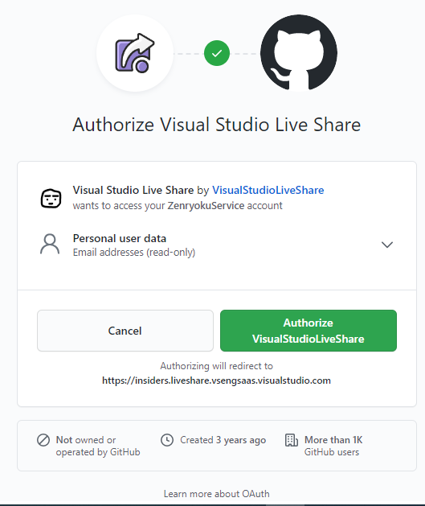

# VS Code の使い方
[参考サイト](https://docs.microsoft.com/en-us/visualstudio/liveshare/use/vscode#share-a-project)

## Live Share
### 設定ファイルの場所
* Windows %APPDATA%\Code\User\settings.json
* Mac $HOME/Library/Application Support/Code/User/settings.json
* Linux $HOME/.config/Code/User/settings.json

#### Githubにアクセス
1. VSCodeからのログインを行う
  https://insiders.liveshare.vsengsaas.visualstudio.com/auth/login
  

2. 認証して、サインイン
