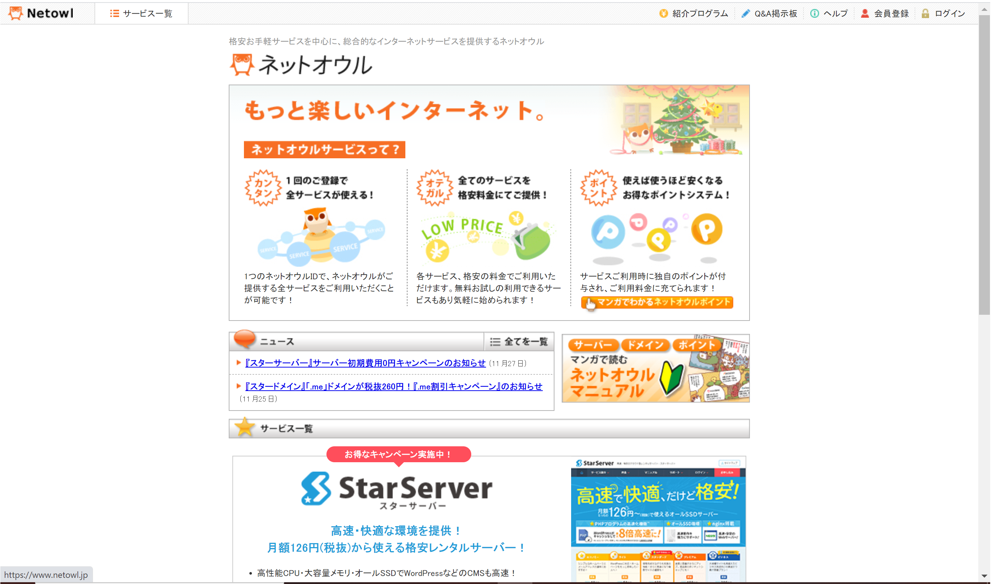
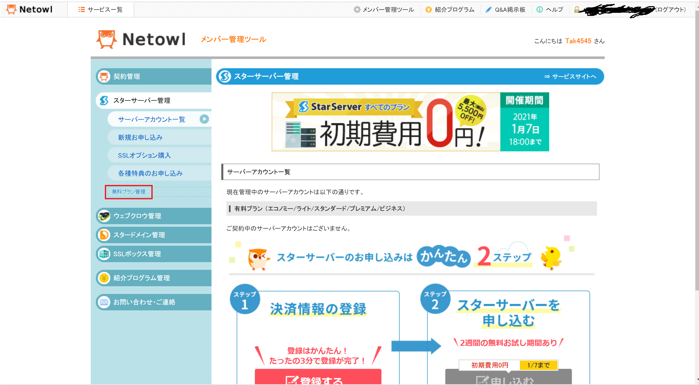
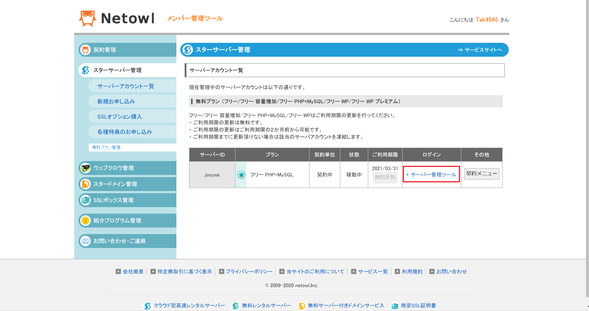
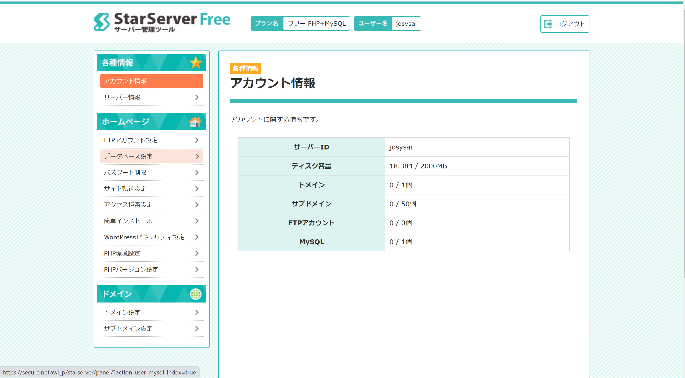
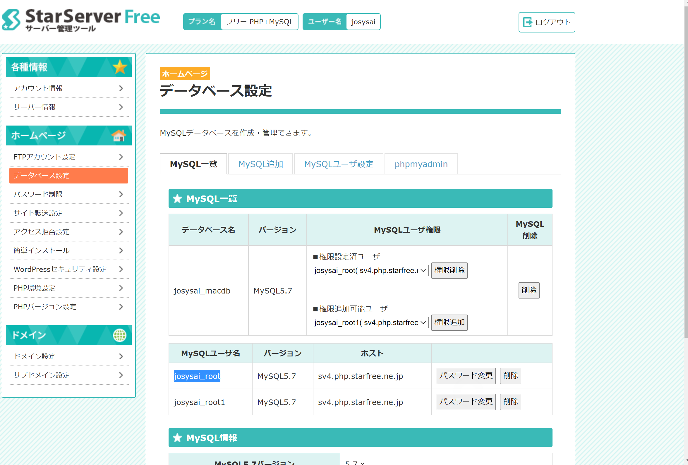

# 作成品を公開する

## ネットオウルの使用
過去の学生の作成品を公開するために、[ネットオウルというレンタルサーバー](https://secure.netowl.jp/)を使用します。

## 資源のデプロイ
1. 作成したアプリのデプロイ先として使用する場合、[このリンク](https://www.star.ne.jp/free/manual/contract_application_1.php)に従い申請を行う。

2. FTPソフトを使用して、作成した資源をレンタルサーバー状にアップロードする。

3. アップロードした資源の起動確認を行う

こちらのページから先輩の作成物を見ることができます。

このレンタルサーバーは無料プランがあり、そのプランを使用しています。

## 管理画面の開き方
1. [このリンク](https://www.netowl.jp/)にアクセスしてログインします。

2. ログイン後、「スターサーバー管理」「無料プラン管理」を選択します。

3. 無料プラン管理の画面を確認し、「サーバー管理ツール」をクリック

4. 無料プランでの管理画面が表示できます。

5. 同様に、データベース設定のリンクより以下の画面でphpMyAdminにアクセスできます。

