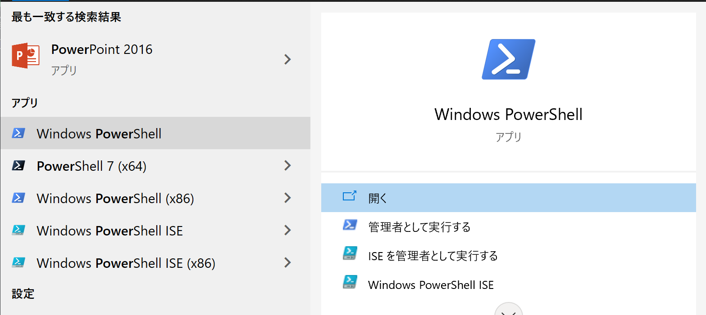

# PowerShellの使い方
[PowerShell](https://docs.microsoft.com/ja-jp/powershell/scripting/overview?view=powershell-7.1) は、コマンドライン シェル、スクリプト言語、および構成管理フレームワークで構成されるクロスプラットフォームのタスク自動化ソリューションです。 PowerShell は **Windows**、Linux、および macOS 上で実行されます。

## Shell(シェル)
PowerShell は、その他の一般的なシェルの最良の機能を備えた最新のコマンド シェルです。 テキストを受け入れて返すだけの大抵のシェルとは異なり、PowerShell は .NET オブジェクトを受け入れて返します。 シェルには次の機能があります。

* 堅牢なコマンドラインの履歴
* タブ補完とコマンド予測 (「about_PSReadLine」を参照してください)
* コマンドとパラメーターの別名のサポート
* コマンド チェーンのパイプライン
* Unix man ページと同様のコンソール内ヘルプ システム

## Windows PowerShell
[こちらを参照しました。](https://docs.microsoft.com/ja-jp/powershell/scripting/windows-powershell/starting-windows-powershell?view=powershell-7.1)
複数のホストに埋め込まれているスクリプト エンジン .DLL です。 開始するホストとして最も一般的なものは、対話型コマンド ラインの powershell.exe および対話型スクリプト環境の powershell_ise.exe です。

### コマンドプロンプトから起動する
次のコマンドを使用して起動する。
> C:\Users\XXXX>PowerShell_ISE

または
> C:\Users\XXXX>ISE

### スタートボタンから起動する
ウィンドウズボタンを押下して、アプリケーションを探すとあります。

